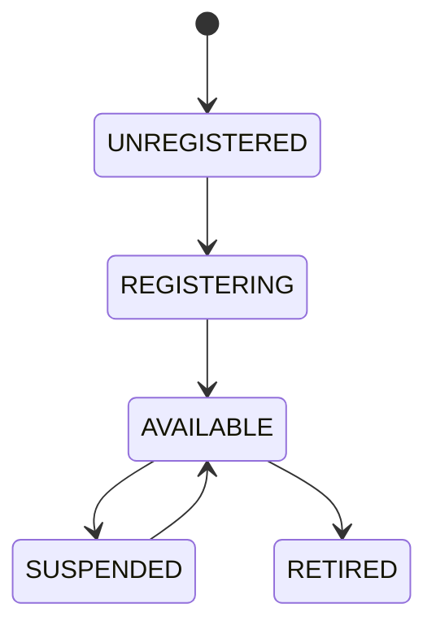

# Service Registry

## Document type
This document is an overview, reference, or index as noted below.

# Service Registry

## Purpose
Defines the canonical registration and lookup mechanism for runtime services.

## Contract
Nothing instantiates services directly; everything registers with the kernel-managed registry.

## State machine

## Validation
Service identifiers must be unique, stable, and versioned.

## Failure modes
Duplicate registration, stale service reference, unavailable dependency, version mismatch.

## Recovery
Unregister stale services, rebind dependencies, and rehydrate from kernel state.

## Cross-references
- `APEX-KERNEL.md`
- `REGISTRY-SYSTEM.md`
- `ORCHESTRATOR.md`

## Governance Rules
Defines service identity, registration, status, ownership, and versioned service metadata.

## Example
A service entry exposes health, version, and lifecycle state before it is scheduled.

## Required details
- Define SCM mapping, dependencies, recovery, and lookup.

## Registry rules
- Define service names, dependencies, recovery actions, and lookup behavior.
- Define Windows SCM mapping for each registered service.
