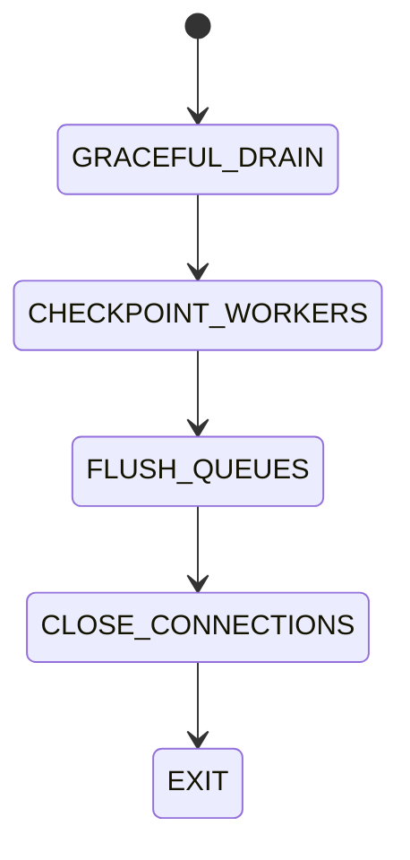

# Shutdown Lifecycle

## Document type
This document is an overview, reference, or index as noted below.

# Shutdown Lifecycle

## Purpose
Defines controlled shutdown behavior.

## State machine

## Allowed transitions
- GRACEFUL_DRAIN -> CHECKPOINT_WORKERS.
- CHECKPOINT_WORKERS -> FLUSH_QUEUES.
- FLUSH_QUEUES -> CLOSE_CONNECTIONS.
- CLOSE_CONNECTIONS -> EXIT.

## Forbidden transitions
- GRACEFUL_DRAIN -> EXIT.
- CHECKPOINT_WORKERS -> EXIT.
- FLUSH_QUEUES -> CHECKPOINT_WORKERS.

## Recovery
- If checkpoint fails, the process remains in GRACEFUL_DRAIN and retries checkpointing.

## Cross-references
- `RUNTIME-OPERATIONS.md`
- `ORCHESTRATOR.md`

## Operational Contract
Defines graceful shutdown, queue flushing, state persistence, worker stop order, and final disposal.

## Example
Execution stops before caches are flushed and state is saved.

## Required details
- Define graceful stop, drain, flush, and forced shutdown behavior.

## Lifecycle model
- Initial state: defined by the lifecycle owner.
- Terminal state: defined by the lifecycle owner.
- Allowed transitions: explicitly listed by the lifecycle owner.
- Forbidden transitions: explicitly listed by the lifecycle owner.
- Recovery transitions: explicitly listed by the lifecycle owner.
- Failure transitions: explicitly listed by the lifecycle owner.
