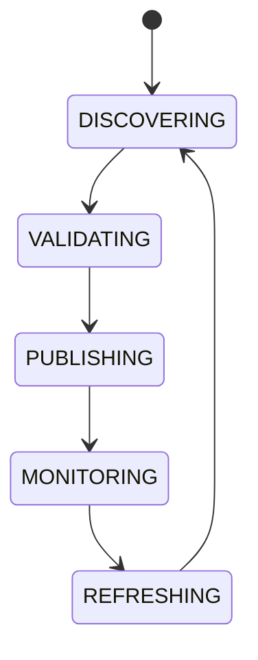

# System Capability Registry

## Purpose
Defines platform-wide capability discovery independent of implementation names.

## Examples
Supports Flash Loans, Permit2, Cross-Chain, Streaming AI, Vision Models, Tool Calling, Batch Execution.

## State machine

## Failure modes
Wrong capability label, stale capability, incompatible version.

## Recovery
Re-scan adapters, revalidate manifests, and suspend stale capabilities.

## Cross-references
- `REGISTRY-SYSTEM.md`
- `PLUGIN-SDK.md`
- `AI-PROVIDER-MANAGER.md`
- `AI-GATEWAY.md`

## Required details
- Define platform capabilities and runtime features.
