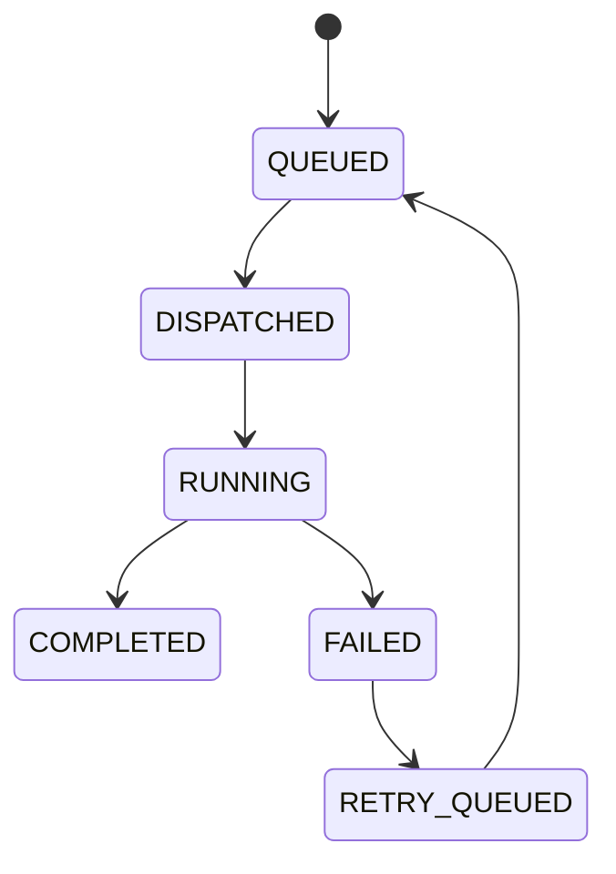

# Task Scheduler

## Purpose
Defines priority queues, fair scheduling, adaptive scheduling, polling intervals, and dynamic allocation.

## State machine

## Failure modes
Queue starvation, unfair dispatch, scheduling drift.

## Recovery
Rebalance queues, adjust weights, and requeue tasks.

## Cross-references
- `WORKER-POOL.md`
- `ORCHESTRATOR.md`
- `EVENT-BUS.md`

## Operational Contract
Defines the responsibilities, invariants, and expected behavior for this component.

## Example
An input is validated before any state-changing action.

## Scheduling rules
- Must define priority, timing resolution, and background worker scheduling.

## Required details
- Define timing resolution and priority scheduling.
