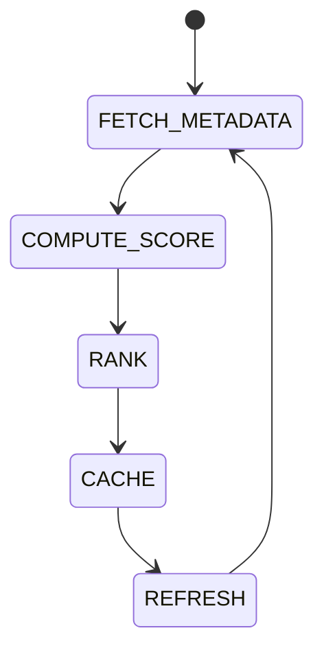

# Token Intelligence

## Purpose
Defines token metadata ingestion, scoring, ranking, caching, and refresh behavior.

## State machine

## Scoring
Combines liquidity, volatility, historical spread, protocol coverage, and DEX availability using configurable weights.

## Configuration
- SCORE_WEIGHTS.
- MIN_SCORE.
- REFRESH_INTERVAL.

## Failure modes
If metadata source fails, use cached values and log a warning.

## Cross-references
- `MARKET-DATA.md`
- `CHAIN-INTELLIGENCE.md`
- `DOMAIN-MODEL.md`
