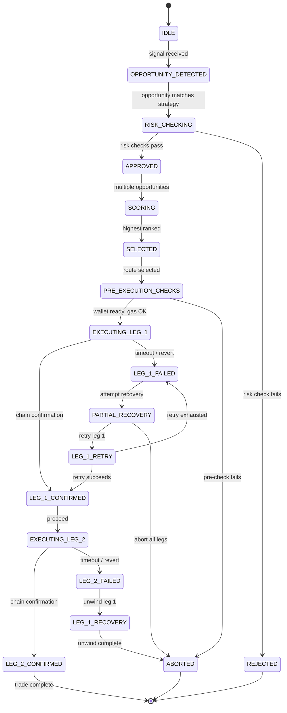

# Trading Engine

## Document type
Document type: [REFERENCE]

## Version
**Version:** 0.2.0 | **Status:** Draft | **Last Updated:** 2026-07-27 | **Owner:** Trading Team

## Purpose
Defines the end-to-end trading decision and execution coordination layer — from opportunity detection through settlement — with explicit trade-flow sequence, failure branching, and recovery paths.

---

## 1. Trade Lifecycle State Machine



---

## 2. Trade Flow Sequence

### 2.1 Opportunity Detection
1. Market data engine emits price update for tracked pairs.
2. Opportunity scanner evaluates all registered strategies against price delta.
3. If spread exceeds strategy threshold, an opportunity is created: `{opportunity_id, strategy_id, chains, pairs, spread, estimated_profit, timestamp}`.

### 2.2 Risk Check
1. Opportunity payload sent to Risk Engine.
2. Risk Engine evaluates: max loss, liquidity, slippage, spread integrity, timing budget.
3. Returns `APPROVED` or `REJECTED` with reason code.
4. If `REJECTED`, opportunity is logged and discarded.

### 2.3 Opportunity Scoring
1. Multiple approved opportunities compete for execution.
2. Scoring: `score = (profit_usd × recency_weight + confidence × trust_weight) / risk_penalty`.
3. Highest-scored opportunity is selected.

### 2.4 Pre-Execution Checks
1. Wallet balance check: sufficient native token for gas.
2. Gas price check: within configured budget (`execution.gas.max_price_gwei`).
3. Network health check: chain RPC responsive, block height synced.
4. Route validity check: DEX liquidity, pair address, contract version.

### 2.5 Leg Execution
1. Leg 1 submitted to Execution Engine (buy on chain A).
2. Wait for confirmation: poll until `execution.confirmation_blocks` blocks pass.
3. On confirmation, immediately submit Leg 2 (sell on chain B).
4. Wait for confirmation.
5. On confirmation, trade is complete.

### 2.6 Settlement
1. Profit calculation: `settlement_profit = leg_2_received - leg_1_cost - gas_total`.
2. Trade record persisted to trade history.
3. Notification sent via configured channels.

---

## 3. Failure Branching

| Failure Point | Condition | Action | Recovery |
|---------------|-----------|--------|----------|
| Leg 1 submission | RPC timeout / revert | Retry up to `execution.retry.max_attempts` | Exponential backoff |
| Leg 1 stuck in mempool | No confirmation after `execution.timeout_ms` | Mark as failed, start partial recovery | Cancel via nonce replacement |
| Leg 1 confirmation | Block reorg > `execution.reorg_safe_depth` | Wait for safe depth, then confirm or revert | If reverting → abort |
| Leg 2 submission after Leg 1 confirmed | RPC timeout / revert | Retry up to `execution.retry.max_attempts` | If all retries fail → unwind Leg 1 |
| Both legs confirmed | Profit < minimum threshold after gas | Flag as marginal, still complete | No recovery needed |
| Wallet gas insufficient mid-trade | Balance check fails before Leg 2 | Pause, attempt to acquire gas token | If no gas after `execution.timeout_ms` → unwind Leg 1 |

---

## 4. Recovery Paths

### 4.1 Partial Recovery (Leg 1 Failed)
```
1. Determine if Leg 1 revert is known (on-chain) or unknown (stuck in mempool).
2. If known revert: abort trade, no further action.
3. If unknown: attempt nonce replacement with higher gas (`gas_price × 1.5`).
4. Wait `execution.confirmation_blocks` for replacement to confirm.
5. If replacement fails → abort. If replacement succeeds → check Leg 2 viability.
6. If Leg 2 still viable, execute. If not, hold position and notify operator.
```

### 4.2 Full Recovery (Leg 1 Unwind)
```
Triggered when Leg 1 is confirmed but Leg 2 cannot be executed.
1. Submit reverse swap on Leg 1's chain (sell what was bought).
2. Accept up to `risk.recovery.max_loss_bps` loss on the unwind.
3. If unwind fails → hold position, flag for manual intervention.
```

### 4.3 Crash Recovery (Platform Restart Mid-Trade)
```
1. On startup, scan event store for trades in EXECUTING_LEG_1 or EXECUTING_LEG_2 state.
2. For each incomplete trade, query actual chain state.
3. If Leg 1 confirmed on-chain → resume with Leg 2.
4. If Leg 1 not confirmed → abort (nonce cancelled).
5. If Leg 1 confirmed but Leg 2 cannot be executed → unwind Leg 1.
6. Trade state updates persisted before each transition.
```

---

## 5. Service Mode Behavior

| Mode | Trading Allowed | Auto-Recovery | Notifications |
|------|----------------|---------------|---------------|
| **Active** | Yes | Yes | All |
| **Paused** | No (existing trades complete) | Yes (completion only) | Critical only |
| **Halted** (operator override) | No | No | All activity logged |
| **Recovery** (post-crash) | No (until recovery scan completes) | Yes (incomplete trades) | Recovery results |

---

## 6. Timeout & Cancellation

- Trade timeout (total from detection to settlement): `trading.timeout_ms` (default 120000ms).
- Leg timeout (per leg): `execution.timeout_ms` (default 30000ms).
- If total timeout exceeded, trade is aborted and recovery initiated.
- Manual cancellation: operator can abort any trade in-flight via dashboard or API.

---

## Cross-References

- **EXECUTION-ENGINE.md** — Transaction-level execution and confirmation.
- **RISK-ENGINE.md** — Risk check formulas and limits.
- **TRADING-LIFECYCLE.md** — Full trade lifecycle state machine.
- **OPPORTUNITY-RANKING.md** — Scoring algorithm detail.
- **ARBITRAGE-WINDOW-MANAGER.md** — Timing window management.
- **EVENT-OWNERSHIP-MATRIX.md** — Trade event producers/consumers.
- **CONFIGURATION-REFERENCE.md** — Trading config keys (`trading.*`, `execution.*`, `risk.*`).
- **TRACEABILITY-MATRIX.md** — Trade requirement coverage.

---

## Version History

| Version | Date | Changes | Author |
|---------|------|---------|--------|
| 0.2.0 | 2026-07-27 | Full trade flow, state machine, failure branching, recovery paths | Trading Team |
| 0.1.0 | 2026-07-27 | Initial stub | Trading Team |