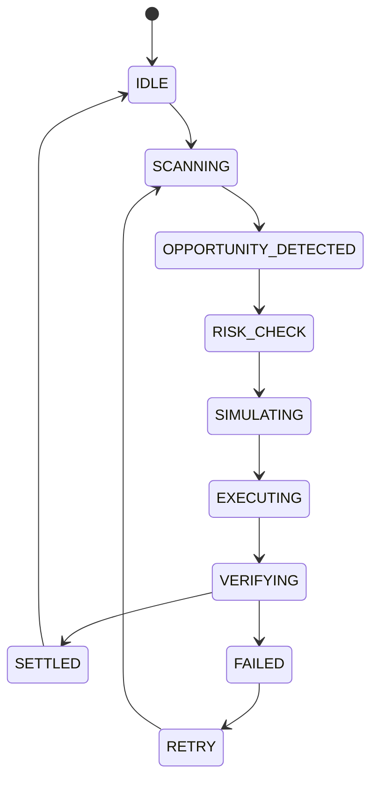

# Trading Lifecycle

## Purpose
Defines the canonical trade state machine.

## State machine

## Allowed transitions
- IDLE -> SCANNING.
- SCANNING -> OPPORTUNITY_DETECTED.
- OPPORTUNITY_DETECTED -> RISK_CHECK.
- RISK_CHECK -> SIMULATING.
- SIMULATING -> EXECUTING.
- EXECUTING -> VERIFYING.
- VERIFYING -> SETTLED or FAILED.
- FAILED -> RETRY.
- RETRY -> SCANNING.

## Forbidden transitions
- EXECUTING -> SETTLED.
- IDLE -> EXECUTING.
- SCANNING -> SETTLED.

## Recovery
- FAILED transitions to RETRY.
- RETRY returns to SCANNING after operator or policy approval.

## Cross-references
- `ORCHESTRATOR.md`
- `EXECUTION-LIFECYCLE.md`
- `RISK-ENGINE.md`
- `SIMULATION-ENGINE.md`
