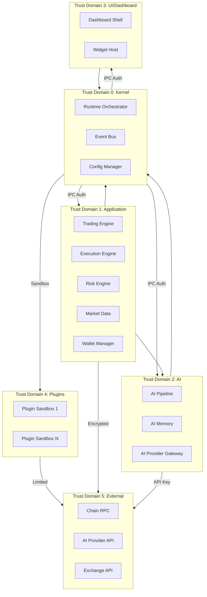

# Trust Boundaries

## Document type
Document type: [REFERENCE]

## Version
**Version:** 0.2.0 | **Status:** Draft | **Last Updated:** 2026-07-27 | **Owner:** Security Team

## Purpose
Defines trusted, semi-trusted, untrusted, plugin, AI, network, and filesystem trust boundaries — including trust-domain enforcement matrix.

---

## 1. Trust Domain Model

Each subsystem in the platform belongs to one trust domain. A trust domain is a security boundary within which all components trust each other implicitly. Crossing a trust boundary requires explicit authorization.

---

## 2. Trust Domain Definitions

| Domain | ID | Trust Level | Description | Isolation |
|--------|----|-------------|-------------|-----------|
| **Kernel** | T0 | **Full trust** | Runtime orchestrator, event bus, config manager | No boundaries within domain |
| **Application** | T1 | **High trust** | Trading, execution, risk, wallet logic | IPC message authentication |
| **AI** | T2 | **High trust** | AI pipeline, memory, provider gateway | IPC message authentication |
| **UI/Dashboard** | T3 | **Medium trust** | Dashboard shell, widget host | IPC typed channel + schema validation |
| **Plugins** | T4 | **Low trust** | Each plugin is individually sandboxed | Process isolation, no shared memory |
| **External** | T5 | **Untrusted** | Chain RPC, AI APIs, exchange APIs | TLS + API key authentication |

---

## 3. Trust Boundary Matrix

| From | To | Permitted Communication | Auth Required | Data Sensitivity |
|------|----|------------------------|---------------|------------------|
| T0 Kernel | T1 Application | IPC typed messages | Implicit (same process) | All |
| T0 Kernel | T2 AI | IPC typed messages | Implicit (same process) | All |
| T0 Kernel | T3 UI | IPC typed messages | Session token | Anonymized trade data |
| T0 Kernel | T4 Plugins | IPC typed messages | Capability grant + signature | Minimal (function args only) |
| T1 Application | T0 Kernel | IPC typed messages | Process identity | All |
| T1 Application | T2 AI | IPC typed messages | Process identity | Trading signals, not secrets |
| T1 Application | T5 External | TLS + API key | Per-connection auth | Chain/order data (encrypted) |
| T2 AI | T0 Kernel | IPC typed messages | Process identity | Prompts, decisions |
| T2 AI | T5 External | TLS + API key | Per-request auth | Prompts (no secrets) |
| T3 UI | T0 Kernel | IPC typed messages | Session token | Anonymized dashboard data |
| T4 Plugins | T0 Kernel | IPC typed messages | Manifest capability grant | Plugin-defined only |
| T4 Plugin A | T4 Plugin B | **Not permitted** | Blocked by sandbox | N/A |

---

## 4. Boundary Enforcement Mechanisms

| Boundary | Mechanism | Enforcement Point |
|----------|-----------|-------------------|
| Process boundary (T0–T3 → T4) | OS process isolation, no shared FS | Plugin sandbox launcher |
| IPC boundary (all intra-process) | Typed IPC channel + schema validation | IPC protocol layer |
| Network boundary (internal → T5) | TLS 1.3 + certificate pinning | Network stack |
| API key boundary (T2/T1 → T5) | Key rotation + HMAC request signing | Provider gateway |
| Session boundary (T3 → T0) | JWT session token + expiry | IPC preload bridge |
| Capability boundary (T4 → T0) | Plugin manifest declares capabilities; enforced at IPC gate | Capability enforcer |

---

## 5. Trust Domain Enforcement Rules

| Rule | Description | Violation Consequence |
|------|-------------|----------------------|
| **No cross-domain shared memory** | Memory owned by one domain must not be accessible by another | Access denied, `security.violation` event |
| **No domain T4 → T4 communication** | Plugins must not communicate with each other directly | Blocked by sandbox process boundary |
| **All cross-domain I/O must be typed IPC** | No raw sockets, pipes, or shared files across domains | `security.violation` event |
| **T3 UI must not receive raw secrets** | Dashboard receives anonymized/anonymized data only | Data is redacted at IPC bridge |
| **T4 plugins must not initiate network calls** | Network calls must go through T0 proxy with capability check | Blocked by sandbox network filter |
| **T5 responses must be validated before entering T1** | Input validation against schema | Malformed data rejected |

---

## 6. Trust Boundary Violation Response

| Severity | Response |
|----------|----------|
| **Critical** (cross-domain memory access) | Immediate subsystem isolation, full audit, user notification via all channels |
| **High** (unauthorized IPC call) | Block call, log violation, increment counter; at threshold (5/min), isolate subsystem |
| **Medium** (suspicious pattern) | Log, warn operator, rate-limit the offending domain |
| **Low** (schema validation failure) | Log, reject data, no further action |

All violations emit a `security.violation` event (Exactly-once delivery, Critical priority — see `EVENT-OWNERSHIP-MATRIX.md`).

---

## 7. Trust Domain Lifecycle

| Event | Action |
|-------|--------|
| Startup | Each domain initializes within its own trust boundary. Cross-domain IPC channels are established with authentication handshake. |
| Domain failure | Adjacent domains continue operation. Affected domain is isolated. IPC channels are closed. |
| Domain recovery | Re-init handshake with authentication. Re-establish IPC channels. Verify no boundary leak. |
| Shutdown | Graceful IPC channel teardown. Each domain cleans its memory. |

---

## Cross-References

- **SECURITY.md** — Overall security architecture.
- **SECURITY-CONTRACTS.md** — Security contracts and policies.
- **SECRET-LIFECYCLE.md** — Secret lifecycle within trust domains.
- **PERMISSION-MODEL.md** — Permission model for intra-domain access.
- **IPC-PROTOCOL.md** — Typed IPC protocol and authentication.
- **PLUGIN-SANDBOX-CONTRACT.md** — Plugin sandbox isolation details.
- **EVENT-OWNERSHIP-MATRIX.md** — Security violation event ownership.
- **CONFIGURATION-REFERENCE.md** — Trust enforcement config keys (`security.trust.*`).

---

## Version History

| Version | Date | Changes | Author |
|---------|------|---------|--------|
| 0.2.0 | 2026-07-27 | Complete trust domain model with matrix, enforcement, violation response | Security Team |
| 0.1.0 | 2026-07-27 | Initial stub | Security Team |