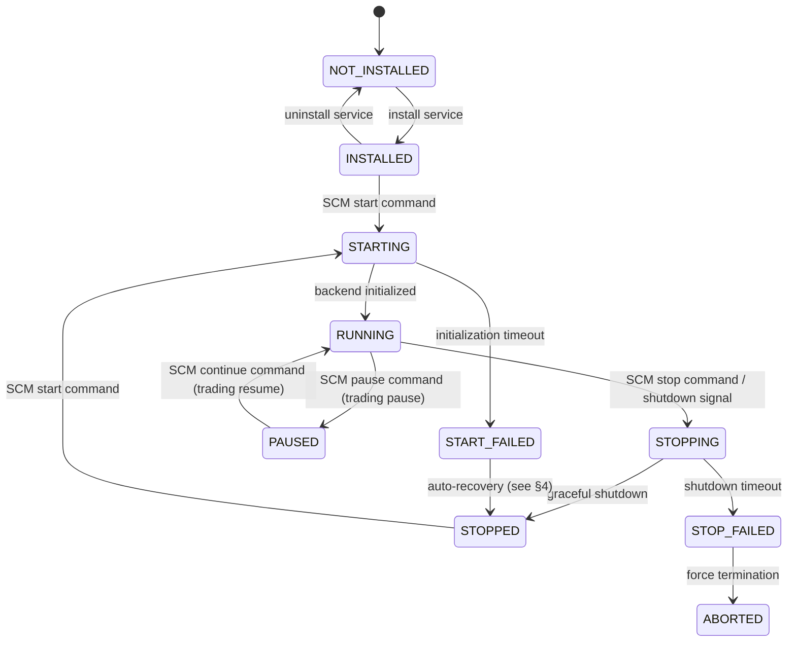

# Windows Service Integration

## Document type
Document type: [CONTRACT]

## Version
**Version:** 1.0.0 | **Status:** Canonical | **Last Updated:** 2026-07-27 | **Owner:** Windows Team

## Purpose
Defines how the trading backend can run under the Windows Service Control Manager — service lifecycle, auto-start, delayed start, recovery actions, session isolation, stop timeout, and installer lifecycle integration.

---

## 1. Service Configuration

| Property | Value | Description |
|----------|-------|-------------|
| **Service name** | `ApexArbitrageBackend` | Display name: "Apex Arbitrage Backend" |
| **Service type** | `SERVICE_WIN32_OWN_PROCESS` | Single process, own binary |
| **Start type** | `SERVICE_AUTO_START` or `SERVICE_DELAYED_AUTO_START` | Configurable via `windows.service.start_type` |
| **Service account** | `LocalSystem` or custom account | `windows.service.account` |
| **Dependencies** | None (no dependency on other Windows services) | — |
| **Description** | "Apex Arbitrage Multichain Trading Backend" | — |

---

## 2. Service Lifecycle State Machine



---

## 3. Service Behavior

### 3.1 Start Behavior

| Step | Action | Timeout | Failure |
|------|--------|---------|---------|
| 1 | Load service configuration | 500ms | Use defaults |
| 2 | Initialize backend (event bus → trading → AI → health) | `windows.service.start_timeout_ms` (default 30000ms) | START_FAILED |
| 3 | Report RUNNING to SCM | Immediate | — |
| 4 | Open IPC bridge for dashboard connection | 5000ms | Continue (dashboard connects later) |

### 3.2 Stop Behavior

| Step | Action | Timeout | Failure |
|------|--------|---------|---------|
| 1 | Pause new trade submissions | Immediate | — |
| 2 | Wait for in-progress trades to complete | `windows.service.stop_grace_ms` (default 10000ms) | Force abort |
| 3 | Flush workspace to disk | 1000ms | Skip (use autosave) |
| 4 | Stop all subsystems in order (AI → plugins → workers → event bus → DB) | 5000ms | Force stop |
| 5 | Report STOPPED to SCM | Immediate | — |

### 3.3 Pause/Continue Behavior

- **Pause**: Trading engine enters Paused mode — no new submissions, existing trades complete.
- **Continue**: Trading engine resumes Active mode.
- Service does NOT actually pause the process — only changes trading mode.
- Dashboard can still connect and view data during pause.

---

## 4. Recovery Actions

| Failure Type | Recovery Action | Reset Period | Config Key |
|-------------|----------------|-------------|------------|
| **First failure** | Restart service | 60s reset counter | `windows.service.recovery.first_action: restart` |
| **Second failure** | Restart service | 60s reset counter | `windows.service.recovery.second_action: restart` |
| **Third failure** | Run command (notification script) | No reset | `windows.service.recovery.third_action: run_command` |
| **Subsequent failures** | Take no action (wait for manual) | No reset | `windows.service.recovery.subsequent_action: none` |
| **Crash (unrecoverable)** | Restart after `windows.service.recovery.restart_delay_ms` (default 5000ms) | — | — |

### Recovery Script (Third Failure)

- Script path: `windows.service.recovery.command_path` (default: `scripts/service-recovery-alert.bat`).
- Script action: show desktop notification + email alert to operator.
- Script timeout: 30000ms.

---

## 5. Session Isolation

| Session | Behavior | Access |
|---------|----------|--------|
| **Session 0** (non-interactive) | Service runs in Session 0 (default for Windows services) | No UI access |
| **Interactive session** | Dashboard process runs in user's interactive session | Full UI access |
| **Session isolation** | Service and dashboard communicate via IPC (named pipe or TCP) | Cross-session IPC |

### Session 0 Rules
- Service cannot create windows, tray icons, or interact with desktop.
- All UI operations handled by dashboard process in interactive session.
- IPC bridge connects Session 0 service to interactive dashboard.
- If no interactive session (no user logged in): service runs headless (trading only, no dashboard).

---

## 6. Installer Lifecycle

### 6.1 Service Install (during app installation)

```
1. Create service via CreateService API.
2. Set recovery actions via ChangeServiceConfig2.
3. Set service description.
4. Configure delayed auto-start if applicable.
5. Register service event source (for Windows Event Log).
6. Test service start → stop → verify basic lifecycle.
```

### 6.2 Service Uninstall (during app uninstallation)

```
1. Stop service via ControlService(SERVICE_CONTROL_STOP).
2. Wait for service to reach STOPPED state (max 10s).
3. Delete service via DeleteService.
4. Remove service event source registration.
5. Clean up registry entries.
```

---

## 7. Cross-Subsystem Integration

| Caller | Purpose | Contract |
|--------|---------|----------|
| Runtime Orchestrator | Service lifecycle management | `service.start` / `service.stop` APIs |
| Windows App Architecture | Service/tray mode selection | `windows.service.mode` config |
| Recovery Coordination | Service restart after crash | `windows.service.recovery.*` config |
| Installer | Install/uninstall service | `CreateService` / `DeleteService` APIs |
| Config Manager | Service config change | `config.updated` event |

| Config Key | Default | Description |
|-----------|---------|-------------|
| `windows.service.start_type` | `auto_start` | Service start type |
| `windows.service.start_timeout_ms` | `30000` | Service start timeout |
| `windows.service.stop_grace_ms` | `10000` | Service stop grace period |
| `windows.service.account` | `LocalSystem` | Service account |
| `windows.service.recovery.first_action` | `restart` | First failure recovery |
| `windows.service.recovery.restart_delay_ms` | `5000` | Recovery restart delay |

---

## Cross-References

- **SERVICE-LIFECYCLE.md** — Platform service lifecycle (state machine).
- **SERVICE-STATE-MACHINE.md** — Service state machine contract.
- **WINDOWS-APP-ARCHITECTURE.md** — Process model and tray/service mode selection.
- **RECOVERY-COORDINATION.md** — Recovery coordination for incomplete executions.
- **SHUTDOWN-LIFECYCLE.md** — Shutdown sequence.
- **IPC-PROTOCOL.md** — Cross-session IPC protocol.
- **CONFIGURATION-REFERENCE.md** — Windows service config keys.

---

## Version History

| Version | Date | Changes | Author |
|---------|------|---------|--------|
| 1.0.0 | 2026-07-27 | Production-grade Windows service contract: service configuration, lifecycle state machine, start/stop/pause behavior with timeouts, 4-level recovery actions, session 0 isolation, installer lifecycle, cross-subsystem integration | Windows Team |
| 0.1.0 | 2026-07-27 | Initial stub | Windows Team |
