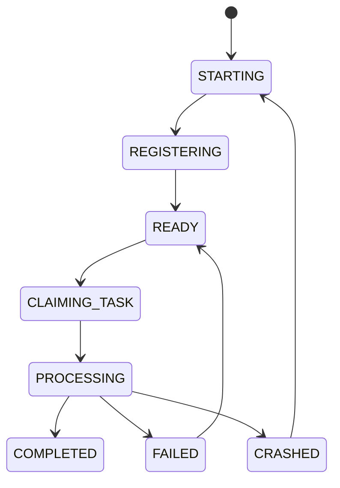

# Worker Pool

## Purpose
Defines formal worker capacity, lifecycle, queue priority, and scaling behavior.

## State machine

## Priority queues
- HIGH: execution.
- MEDIUM: simulation and risk.
- LOW: learning and metrics.

## Dynamic strategy weighting
weight = (strategy_recent_performance * config.KP) + (strategy_opportunity_density * config.KD).
If success rate < MIN_SUCCESS_RATE, weight is zeroed.

## Scaling policy
- Scale out when queue depth > 100 for 5 seconds.
- Scale in when idle > 60 seconds.

## Configuration
- MIN_WORKERS.
- MAX_WORKERS.
- QUEUE_BACKLOG_THRESHOLD.
- SCALE_COOLDOWN_SECONDS.
- HIGH_QUEUE_CAPACITY.

## Cross-references
- `EVENT-BUS.md`
- `ORCHESTRATOR.md`
- `PERFORMANCE-SLOS.md`

## Operational Contract
Defines the responsibilities, invariants, and expected behavior for this component.

## Example
An input is validated before any state-changing action.
