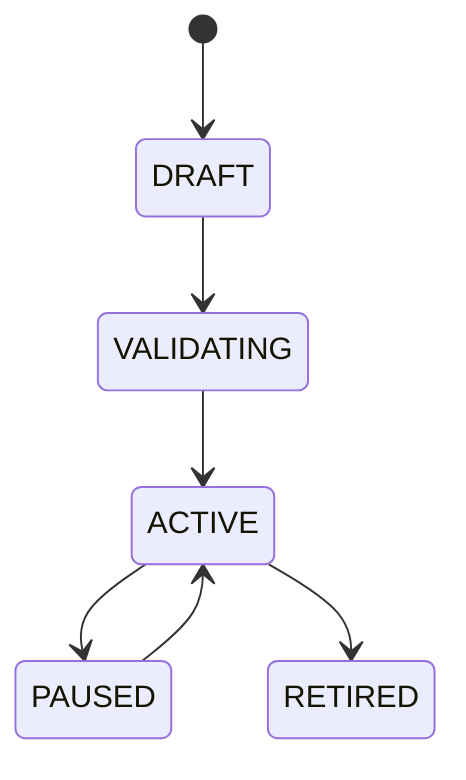

# Workflow Builder

## Purpose
Defines user-authored automation workflows that connect events, gates, actions, and notifications.

## State machine

## Contract
Workflows are event-driven and policy-checked before activation.

## Failure modes
Invalid graph, policy violation, missing action handler, loop detection.

## Recovery
Pause workflow, require correction, or route to fallback manual operation.

## Cross-references
- `EVENT-BUS.md`
- `POLICY-ENGINE.md`
- `ORCHESTRATOR.md`
- `UI-DASHBOARD-SPEC.md`
