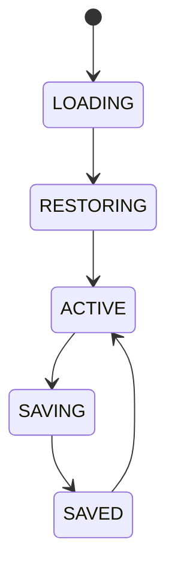

# Workspace Manager

## Purpose
Defines workspace ownership, layout, settings, providers, dashboards, strategies, and wallets for each workspace.

## State machine

## Cross-references
- `DASHBOARD-WORKSPACES.md`
- `WINDOWS-DESKTOP.md`
- `CONFIGURATION-PROFILES.md`
