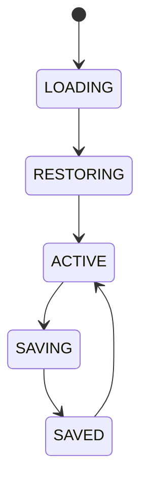

# Workspace Manager

## Document type
This document is an overview, reference, or index as noted below.

# Workspace Manager

## Purpose
Defines workspace ownership, layout, settings, providers, dashboards, strategies, and wallets for each workspace.

## State machine

## Cross-references
- `DASHBOARD-WORKSPACES.md`
- `WINDOWS-DESKTOP.md`
- `CONFIGURATION-PROFILES.md`

## Operational Contract
Defines workspace composition, layout, settings, dashboard bindings, provider selection, and recovery state.

## Example
A simulation workspace restores its selected chain, wallet, and layout on reopen.
