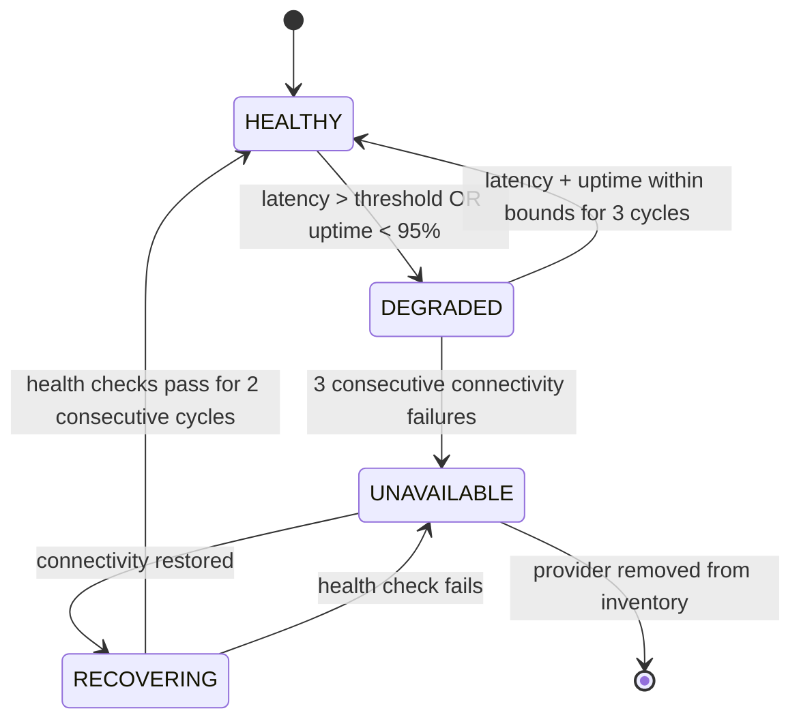

# AI Provider Manager

## Document type
Document type: [CONTRACT]

## Version
**Version:** 1.0.0 | **Status:** Canonical | **Last Updated:** 2026-07-27 | **Owner:** AI Team

## Purpose
Defines provider abstraction, capability detection, provider scoring, health monitoring, failover, cost-aware selection, provider configuration, and test-connection behavior.

---

## 1. Provider Inventory

| Provider | ID | Supported Models | Capabilities | Fallback Priority | Latency P50 | Cost/1k Tokens | Uptime Target |
|----------|----|-----------------|-------------|-------------------|-------------|---------------|--------------|
| **OpenAI** | `provider.openai` | GPT-4o, GPT-4o-mini | Chat, FC, Streaming, Vision | 1 | 800ms | $0.03/$0.015 | 99.5% |
| **Anthropic** | `provider.anthropic` | Claude 3.5 Sonnet, Haiku | Chat, FC, Streaming | 2 | 1200ms | $0.04/$0.008 | 99.5% |
| **Google** | `provider.google` | Gemini 1.5 Pro, Flash | Chat, FC, Streaming, Vision | 3 | 1000ms | $0.035/$0.01 | 99.0% |
| **OpenRouter** | `provider.openrouter` | 50+ models (proxy) | Chat, FC, Streaming | 4 | 1500ms | Variable | 98.0% |
| **Groq** | `provider.groq` | Llama 3, Mixtral | Chat, FC, Streaming | 5 | 200ms | $0.001 | 98.5% |
| **Local (Ollama)** | `provider.local` | Llama 3, Mistral, Phi | Chat, FC | 6 (last resort) | 5000ms+ | $0 (local) | N/A (local) |
| **Custom** | `provider.custom` | User-defined | Per provider definition | Configurable | Configurable | Configurable | Configurable |

---

## 2. Provider Scoring Algorithm

### 2.1 Scoring Formula

```
provider_score = speed_weight × (1 / latency_p50_ms)
              + cost_weight × (1 / cost_per_1k_input_tokens)
              + reliability_weight × (uptime_pct / 100)
              + capability_weight × (capability_match_pct / 100)

where:
  latency_p50_ms: median latency in milliseconds
  cost_per_1k_input_tokens: USD cost per 1000 input tokens
  uptime_pct: percentage uptime over last 24h
  capability_match_pct: percentage of required capabilities supported

defaults:
  speed_weight: 0.3
  cost_weight: 0.2
  reliability_weight: 0.3
  capability_weight: 0.2

Normalization:
  All scores normalized to [0, 1] range before weighting
  latency: normalize by dividing by max_latency in eligible providers
  cost: normalize by dividing by max_cost in eligible providers
```

### 2.2 Scoring Example

```
Request requires: Chat + FC + Streaming
Eligible providers: OpenAI, Anthropic, Groq

OpenAI:
  speed: 0.3 × (1/800) × 1000 = 0.375
  cost: 0.2 × (1/0.03) × 0.03 = 0.2 × 1.0 = 0.2 (normalized)
  reliability: 0.3 × 0.995 = 0.2985
  capability: 0.2 × 1.0 (all 3 supported) = 0.2
  total: 1.074

Anthropic:
  speed: 0.3 × (1/1200) × 1000 = 0.25
  cost: 0.2 × (1/0.04) × 0.04 = 0.2 × 1.0 = 0.2 (normalized)
  reliability: 0.3 × 0.995 = 0.2985
  capability: 0.2 × 1.0 = 0.2
  total: 0.949

Groq:
  speed: 0.3 × (1/200) × 1000 = 1.5 (normalized to 1.0)
  cost: 0.2 × (1/0.001) × 0.001 = 0.2 × 1.0 = 0.2 (normalized)
  reliability: 0.3 × 0.985 = 0.2955
  capability: 0.2 × 1.0 = 0.2
  total: 1.695 → normalized 1.0 → selected (speed advantage)
```

### 2.3 Penalty Factors

| Condition | Penalty | Applied To |
|-----------|---------|-----------|
| Provider FAILED in last `ai.providers.failure_cooldown_ms` | Score × 0.0 (skip entirely) | All scores |
| Provider rate-limited (429 received) | Score × 0.5 | All scores |
| Provider latency exceeds `ai.providers.max_latency_ms` | Score × 0.3 | Speed component |
| Provider cost exceeds `ai.providers.max_cost_per_1k` | Score × 0.3 | Cost component |
| Provider uptime < 95% | Score × 0.5 | Reliability component |

---

## 3. Health Monitoring

### 3.1 Health Check Schedule

| Check Type | Interval | Timeout | Failure Threshold | Recovery Action |
|-----------|----------|---------|-------------------|-----------------|
| **Connectivity** | 30s | 5000ms | 3 consecutive failures | Mark UNAVAILABLE, skip in selection |
| **Latency** | 60s | 10000ms | P50 > `max_latency_ms` for 5 checks | Demote priority, reduce score |
| **Capability** | 5min | 15000ms | Model removed or API changed | Update capability matrix, notify |
| **Rate limit status** | 30s | — | Rate limit active | Apply penalty factor |
| **Cost tracking** | Per request | — | Monthly budget exceeded | Block non-critical requests |

### 3.2 Provider Health States



### 3.3 Health Check Procedure

```
1. Send lightweight probe request to provider (1 token input, expect 1 token output).
2. Measure round-trip latency.
3. Validate response schema.
4. Check rate limit headers.
5. Record result in provider health store.
6. Update provider score.
7. If provider transitions to UNAVAILABLE → emit ai.provider.unavailable event.
8. If provider transitions to HEALTHY from DEGRADED → emit ai.provider.recovered event.
```

---

## 4. Failover Policy

### 4.1 Failover Chain

```
Primary (highest score) → Secondary → Tertiary → All Failed
```

- Failover is automatic on: timeout, 5xx, rate limit (429), health UNAVAILABLE.
- Each failover step increments counter; after 3 failovers in 5min → throttle to 1 req/min for 10min.
- Failover preserves request intent, context, and token budget.
- Failed provider enters DEGRADED/UNAVAILABLE state after failover.

### 4.2 Failover Decision Matrix

| Error | Retry Within Provider | Fallback to Next Provider |
|-------|----------------------|--------------------------|
| 429 (rate limit) | Wait `rate_limit_wait_ms`, retry 1× | After retry fails |
| 5xx (server error) | Retry 2× with backoff (1s, 3s) | After retries exhausted |
| Timeout | Retry 1× with longer timeout | After retry fails |
| 401 (auth error) | No retry (config issue) | Immediate fallback |
| 400 (bad request) | No retry (request issue) | Immediate fallback (or reject if request invalid) |
| Network error | Retry 1× | After retry fails |
| Validation fail | Re-prompt with stricter instructions, retry 1× | After retry fails |

---

## 5. Cost-Aware Selection

### 5.1 Cost Budget Tracking

| Budget Level | Monthly Limit | Enforcement |
|-------------|-------------|-------------|
| **Total monthly** | `ai.cost.max_monthly_usd` (default 50.0) | Hard cap — reject all requests when exceeded |
| **Daily soft cap** | `ai.cost.max_daily_usd` (default 5.0) | Non-critical agents disabled |
| **Per-request cap** | `ai.cost.max_request_usd` (default 0.10) | Reject expensive requests |
| **Per-agent cap** | `ai.cost.max_agent_monthly_usd` (default 15.0) | Agent-specific monthly cap |

### 5.2 Cost Optimisation Strategies

| Strategy | Description | Trigger |
|----------|-------------|---------|
| **Tier selection** | Route simple requests to cheaper models | Complexity < `model_tier_threshold` |
| **Token minimization** | Prune context before sending | Context > 80% of max tokens |
| **Cache reuse** | Return cached response for similar queries | Semantic similarity > 0.9 |
| **Local preference** | Use local model for non-critical requests | `ai.local.prefer_for_non_critical` |
| **Batch consolidation** | Combine similar requests in time window | Multiple requests in batch window |

### 5.3 Cost Formula

```
request_cost = (input_tokens × cost_per_1k_input / 1000)
            + (output_tokens × cost_per_1k_output / 1000)

monthly_total = Σ(all request costs in rolling 30-day window)
daily_total = Σ(all request costs in rolling 24-hour window)
```

---

## 6. Provider Configuration

### 6.1 Configuration Schema

```json
{
  "provider_id": "provider.openai",
  "name": "OpenAI",
  "base_url": "https://api.openai.com/v1",
  "api_key_source": "secret.openai_api_key",
  "models": [
    {
      "id": "gpt-4o",
      "capabilities": ["chat", "function_calling", "streaming", "vision"],
      "max_tokens": 128000,
      "cost_per_1k_input": 0.03,
      "cost_per_1k_output": 0.06,
      "latency_p50_ms": 800,
      "rate_limit_rpm": 500,
      "rate_limit_tpm": 30000
    },
    {
      "id": "gpt-4o-mini",
      "capabilities": ["chat", "function_calling", "streaming"],
      "max_tokens": 128000,
      "cost_per_1k_input": 0.015,
      "cost_per_1k_output": 0.06,
      "latency_p50_ms": 400,
      "rate_limit_rpm": 500,
      "rate_limit_tpm": 200000
    }
  ],
  "fallback_priority": 1,
  "health_check_interval_ms": 30000,
  "failure_cooldown_ms": 60000,
  "timeout_ms": 10000,
  "retry_policy": {
    "max_retries": 3,
    "backoff_ms": [1000, 3000, 5000],
    "retry_on": ["5xx", "timeout", "network_error"]
  }
}
```

---

## 7. Cross-Subsystem Integration

### 7.1 Who Calls Provider Manager

| Caller | Purpose | Contract |
|--------|---------|----------|
| AI Pipeline | Select provider for request | `ai.provider.select` API |
| AI Orchestration | Orchestration needs provider list | `ai.provider.list` API |
| Health Checker | Provider health status | `ai.provider.health` API |
| Config Manager | Provider config change | `config.updated` event |
| Dashboard | Display provider status | `dashboard.ai` IPC channel |

### 7.2 Who Provider Manager Calls

| Target | Purpose | Contract |
|--------|---------|----------|
| AI Pipeline | Provider selected → execute request | `ai.pipeline.execute` callback |
| Secret Manager | Get provider API key | `secret.get` API |
| Event Bus | Emit provider events | `ai.provider.*` events |
| Health Checker | Register provider health checks | `health.register` API |

### 7.3 Events Provider Manager Emits

| Event | Payload | Consumer |
|-------|---------|----------|
| `ai.provider.health_changed` | `{provider_id, old_state, new_state, reason}` | Dashboard, Health, AI Orchestration |
| `ai.provider.selected` | `{provider_id, model, request_id, score, reason}` | AI Pipeline, Audit |
| `ai.provider.failed` | `{provider_id, model, error_code, fallback_provider_id}` | AI Pipeline, Health |
| `ai.provider.recovered` | `{provider_id, model, recovery_duration_ms}` | Dashboard, Health |
| `ai.cost.budget_exceeded` | `{budget_type, current_usd, limit_usd, disabled_agents}` | Dashboard, Operator |

---

## Cross-References

- **AI-ORCHESTRATION.md** — Multi-agent orchestration and coordination.
- **AI-PIPELINE.md** — AI request routing and context assembly.
- **MODEL-CAPABILITY-NEGOTIATION.md** — Model capability negotiation detail.
- **AI-COST-MANAGEMENT.md** — Cost tracking and budget enforcement.
- **AI-GATEWAY.md** — Provider gateway implementation.
- **SECRET-LIFECYCLE.md** — API key storage and rotation.
- **CONFIGURATION-REFERENCE.md** — Provider config keys (`ai.providers.*`).
- **END-TO-END-WIRING-CONTRACT.md** — Cross-subsystem wiring.
- **TRACEABILITY-MATRIX.md** — REQ-AI-001, REQ-AI-006.

---

## Version History

| Version | Date | Changes | Author |
|---------|------|---------|--------|
| 1.0.0 | 2026-07-27 | Production-grade provider manager contract: 7-provider inventory, scoring algorithm with penalty factors, health monitoring with state machine, failover decision matrix, cost-aware selection with budget tracking, provider configuration schema, cross-subsystem integration | AI Team |
| 0.1.0 | 2026-07-27 | Initial stub | AI Team |
