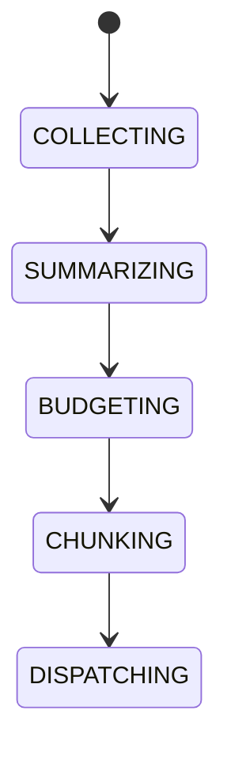

# Ai Context Window Management

## Document type
This document is an overview, reference, or index as noted below.

# AI Context Window Management

## Purpose
Defines context compression, rolling summaries, token budgeting, memory retrieval, and chunk selection.

## State machine

## Failure modes
Context overflow, stale summary, missing retrieval, token budget breach.

## Recovery
Compress, trim, retrieve alternate memory, or refuse request.

## Cross-references
- `ai/runtime/AI-PIPELINE.md`
- `ai/memory/AI-MEMORY-SYSTEM.md`
- `CONTEXT-BUILDER.md`
- `TRACEABILITY-MATRIX.md`

## Governance Rules
Defines token budgeting, compression, rolling summaries, chunk selection, and retrieval prioritization.

## Example
Long market history is compressed before dispatching a prompt to the AI provider.

## Context rules
- Define what enters the AI context window, what is summarized, and what is excluded.
- Define token budget and retention behavior.
