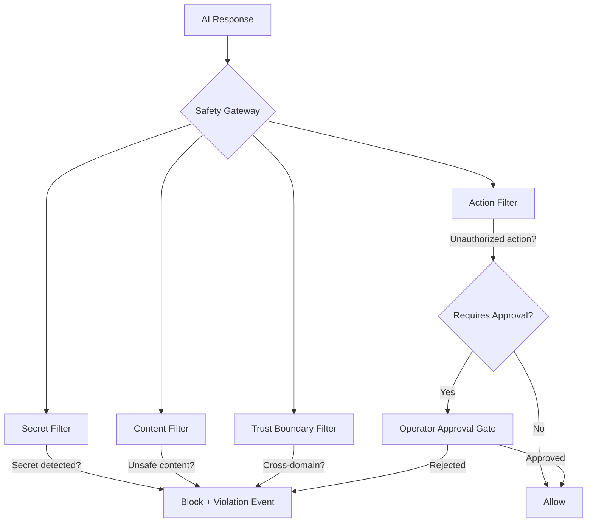

# AI Safety Boundary

## Document type
Document type: [CONTRACT]

## Version
**Version:** 1.1.0 | **Status:** Canonical | **Last Updated:** 2026-07-27 | **Owner:** AI Team

## Purpose
Defines the complete set of safety boundaries governing AI behavior — what AI may and may not do, when human approval is required, enforcement mechanisms, violation response, and integration with trust boundaries, permission model, and security contracts.

---

## 1. Safety Boundary Definitions

### 1.1 Absolute Boundaries (Never Permitted)

| Boundary ID | Description | Enforcement | Violation Response |
|-------------|-------------|-------------|-------------------|
| **SB-001** | AI must never access raw secrets, private keys, or wallet credentials | All secret references are replaced with handles before prompt injection; tool registry blocks secret-access tools | Immediate abort; `security.violation` event (Critical severity); full audit |
| **SB-002** | AI must never directly execute financial transactions without operator approval | Trading execution requires operator confirmation for trades > `risk.max_per_trade_usd`; AI can only propose, not execute | Block execution; emit `security.violation` event; notify operator |
| **SB-003** | AI must never modify system configuration without operator approval | AI can only suggest config changes; actual mutation requires operator approval via dashboard or API | Reject modification; log suggestion for operator review |
| **SB-004** | AI must never bypass trust domain boundaries | AI operates in T2; cannot access T0 kernel internals, T4 plugin memory, or T1 wallet secrets | IPC gateway rejects cross-domain access; `security.violation` event |
| **SB-005** | AI must never initiate network calls outside the allowed provider list | Only registered AI provider endpoints are permitted; no arbitrary URLs | Network filter blocks request; `security.violation` event |
| **SB-006** | AI must never produce unfiltered output to external channels | All AI output passes through safety filter before display or persistence | Content is stripped or blocked; safety violation logged |
| **SB-007** | AI must never delegate to another AI agent without explicit safety check | Multi-agent delegation requires safety approval gate | `delegate_task` blocked without approval; `security.violation` if attempted |

### 1.2 Conditional Boundaries (Requires Human Approval)

| Boundary ID | Description | Condition for Approval | Approval Mechanism | Default |
|-------------|-------------|------------------------|--------------------|---------|
| **SB-008** | AI proposes a trade exceeding `risk.max_per_trade_usd` threshold | Operator confirms via dashboard | Dashboard approval modal + API confirmation | Blocked (requires approval) |
| **SB-009** | AI proposes a new strategy not in the approved strategy catalog | Architecture review + operator confirmation | Strategy approval workflow in dashboard | Blocked (requires approval) |
| **SB-010** | AI proposes configuration changes that require restart | Operator review and explicit acceptance | Config change request → operator dashboard approval | Blocked (requires approval) |
| **SB-011** | AI requests elevated tool access beyond current capability grant | Security team review | Tool capability escalation workflow | Blocked (requires approval) |
| **SB-012** | AI identifies a pattern requiring emergency action (e.g., wallet drain detection) | Operator must confirm the emergency action | Emergency action modal with countdown | Auto-alert only (no auto-action) |

### 1.3 Operational Boundaries (AI Permitted Within Limits)

| Boundary ID | Description | Limits | Enforcement |
|-------------|-------------|--------|-------------|
| **SB-013** | AI may propose trades within approved strategy parameters | Trade size ≤ `risk.max_per_trade_usd`; spread ≥ `risk.min_arb_spread_pct` | Risk engine validates before execution |
| **SB-014** | AI may invoke registered tools within capability grants | Only tools in Tier 1–4 of `ai/tools/AI-TOOL-INVOCATION-CONTRACT.md` | Tool registry enforces; IPC gateway validates |
| **SB-015** | AI may read system state (positions, balances, risk status) | Read-only access via IPC typed channels (anonymized for T3) | IPC bridge enforces read-only for AI domain |
| **SB-016** | AI may update its own memory and reflection store | Capacity ≤ `ai.memory.max_entries`; TTL ≤ `ai.memory.ttl_days` | Memory system enforces capacity and TTL |
| **SB-017** | AI may provide risk assessments and scoring | Advisory only — no direct risk engine mutation | Risk engine is authoritative; AI output is advisory |
| **SB-018** | AI may generate dashboard notifications and alerts | Rate-limited: max 10 notifications per minute | Notification rate limiter enforces |

---

## 2. Safety Enforcement Architecture



### Safety Gateway Pipeline

Every AI response passes through a 4-layer safety gateway:

| Layer | Check | Mechanism | Failure Action |
|-------|-------|-----------|----------------|
| **Secret Filter** | Detect and redact any secret references in AI output | Regex pattern matching for keys, passwords, addresses, seed phrases | Redact + log + emit `security.violation` if intentional |
| **Content Filter** | Detect unsafe, harmful, or policy-violating content | Blocklist regex + semantic classifier + response schema validation | Strip unsafe content; if severe → block entire response |
| **Action Filter** | Validate that proposed actions are within AI's authorized scope | Action registry check against SB-008 through SB-018 boundaries | Require approval (SB-008–012) or allow (SB-013–018) |
| **Trust Boundary Filter** | Ensure AI output doesn't attempt cross-domain access | Trust domain enforcement matrix (see `TRUST-BOUNDARIES.md`) | Block + `security.violation` event |

---

## 3. Safety Violation Response

| Severity | Examples | Response | Event | Operator Notification |
|----------|---------|----------|-------|----------------------|
| **Critical** | SB-001 (secret access), SB-002 (unauthorized trade execution), SB-007 (unauthorized agent delegation) | Immediate abort of entire AI call; block all pending AI requests for 5 min; full audit | `security.violation` (Exactly-once, Critical priority) | Immediate: all channels (dashboard, notification, event log) |
| **High** | SB-004 (trust boundary bypass attempt), SB-005 (unauthorized network), SB-006 (unfiltered output) | Abort AI call; log violation; increment violation counter | `security.violation` (Exactly-once, High priority) | Dashboard notification + event log |
| **Medium** | Repeated content filter triggers, attempted actions without approval | Strip unsafe content; log warning; rate-limit AI calls | `system.warning` (At-least-once, Medium priority) | Dashboard warning |
| **Low** | Minor schema violations, low-confidence responses | Truncate or fix; log | `system.warning` (Low priority) | Event log only |

### Escalation Rules

| Condition | Action |
|-----------|--------|
| 1 Critical violation | Abort call + 5-min AI pause + operator alert |
| 2 Critical violations in 10 min | Pause all AI operations + security team paged |
| 3+ Medium violations in 5 min | Throttle AI to 1 request/min for 15 min |
| 5+ Low violations in 10 min | Log aggregation only (no throttling) |
| Violation counter resets | After 30 min of clean operation |

---

## 4. Human Approval Gate

### Approval Mechanism

When a conditional boundary (SB-008 through SB-012) is triggered:

```
1. AI proposes action → Safety Gateway detects conditional boundary.
2. Action is held in approval queue.
3. Dashboard shows approval modal with:
   - Action description
   - Risk assessment
   - Recommended decision (AI suggestion)
   - Countdown timer (default 60s; if not approved → auto-reject)
4. Operator reviews and clicks Approve or Reject.
5. If Approved → action dispatched to appropriate subsystem.
6. If Rejected → action discarded; AI notified of rejection reason.
7. If Timeout → auto-reject; operator notified of missed approval.
8. All approval decisions logged in audit trail.
```

### Approval Categories

| Category | Default Timeout | Auto-Action on Timeout | Override |
|----------|----------------|------------------------|----------|
| Trade approval (SB-008) | 60s | Reject (no trade executed) | Operator can extend to 5 min |
| Strategy approval (SB-009) | 300s | Reject (strategy not added) | Architecture review required |
| Config change approval (SB-010) | 300s | Reject (config unchanged) | Operator can pre-approve common changes |
| Tool capability escalation (SB-011) | 120s | Reject (tool not elevated) | Security team pre-approval possible |
| Emergency action (SB-012) | 30s | Auto-alert only (no action taken) | Operator must confirm within 30s |

---

## 5. Integration with Trust Boundaries and Permission Model

### Trust Boundary Mapping

| Safety Boundary | Trust Domain | Enforcement Point | Reference |
|-----------------|-------------|-------------------|-----------|
| SB-001 | T2 → T1/T0 blocked | IPC secret filter + prompt injection filter | `TRUST-BOUNDARIES.md` §3 |
| SB-002 | T2 → T1 (advisory only) | Trading Engine rejects AI-initiated trades without approval | `TRUST-BOUNDARIES.md` §3 |
| SB-003 | T2 → T0/T14 (advisory only) | Config Manager rejects AI mutations | `TRUST-BOUNDARIES.md` §3 |
| SB-004 | T2 → T*/T4 blocked | IPC gateway | `TRUST-BOUNDARIES.md` §3 |
| SB-005 | T2 → T5 (provider only) | Network filter | `TRUST-BOUNDARIES.md` §3 |
| SB-006 | T2 → T3/T5 (filtered output) | Content filter gateway | `TRUST-BOUNDARIES.md` §3 |
| SB-007 | T2 → T2 (safety gate) | Agent delegation safety check | `ai/tools/AI-TOOL-INVOCATION-CONTRACT.md` §6 |

### Permission Model Mapping

| Role | Safety Boundary Access | Approval Required |
|------|------------------------|-------------------|
| **Operator** | Full; can override all conditional boundaries | None (has full authority) |
| **Trader** | SB-013 (propose trades), SB-015 (read state), SB-017 (risk assessments), SB-018 (notifications) | SB-008 for large trades |
| **Viewer** | SB-015 (read state only), SB-018 (notifications) | None (read-only) |
| **Plugin** | SB-014 (invoke tools within granted capabilities only) | SB-011 for capability escalation |

---

## Cross-References

- **TRUST-BOUNDARIES.md** — Trust domain definitions and enforcement matrix.
- **SECURITY.md** — Overall security architecture.
- **SECURITY-CONTRACTS.md** — Security contracts and policies.
- **PERMISSION-MODEL.md** — Role/action permission matrix.
- **AI-TOOL-INVOCATION-CONTRACT.md** — Tool invocation priority and safety.
- **AI-PIPELINE.md** — AI pipeline safety integration.
- **PROMPT-LIFECYCLE.md** — Prompt construction safety checks.
- **TRACEABILITY-MATRIX.md** — REQ-SECURITY-001, REQ-SECURITY-002, REQ-AI-006.
- **CONFIGURATION-REFERENCE.md** — `ai.safety.*`, `security.*` config keys.

---

## Version History

| Version | Date | Changes | Author |
|---------|------|---------|--------|
| 1.1.0 | 2026-07-27 | Complete 18 safety boundaries (7 absolute, 5 conditional, 6 operational), enforcement architecture, violation response, human approval gate, trust/permission integration | AI Team |
| 1.0.0 | 2025-01-15 | Initial stub (2 lines) | AI Team |
