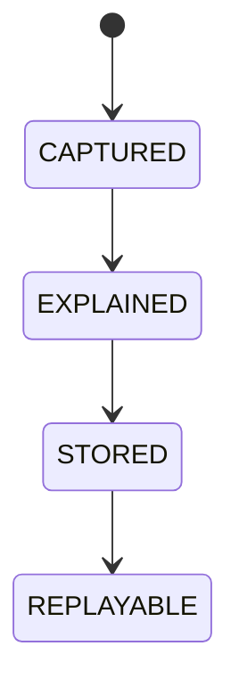

# Explainability

## Document type
Document type: [CONTRACT]

## Purpose
Defines the mandatory trace format for every decision, recommendation, and action.

## Required fields
- Decision ID.
- Rationale.
- Confidence.
- Alternatives considered.
- Inputs used.
- Gates passed.
- Veto source.
- Timestamp.

## Explanation rules
- Explain why actions were taken, skipped, or delayed.
- Capture inputs, outputs, and decision context for auditability.
- Arbitrage explanations must state why opportunities were taken or skipped, including the rejection reason.
- An explanation without a rationale is non-compliant and is rejected for storage.

## State machine

## Failure modes
Missing rationale, incomplete inputs, untraceable decision, expired replay data.

## Recovery
Reject storage, request re-evaluation, or mark the decision as non-compliant.

## Cross-references
- `../orchestration/ai-orchestration.md`
- `../../execution/risk-policy/decision-engine.md`
- `../learning/learning-pipeline.md`
- `../../operations/monitoring/metrics.md`

For governance-grade trace compliance, see `./governance-explainability.md`.

## Operational Contract

This document owns the trace format and explanation rules for decisions, recommendations, and actions. Governance-grade audit lineage is owned by `governance-explainability.md`. Every decision must produce a replayable explanation; a decision that cannot be explained is not stored.

## Example
An arbitrage opportunity is skipped because it fails the minimum-profit gate; the explanation records the gate result, the inputs, and the reason.
