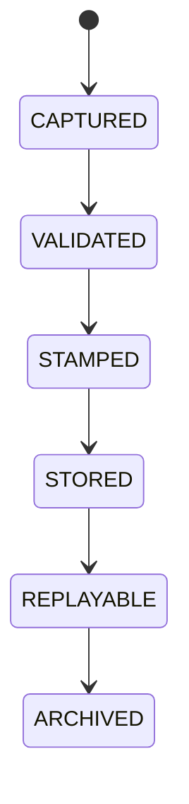

# Governance Explainability

## Document type
Document type: [CONTRACT]

## Purpose
Defines the compliance-heavy owner for audit lineage, rationale retention, replayability, and decision trace governance.

## Scope
All decisions, approvals, overrides, policy changes, provider changes, strategy changes, and recovery actions.

## Required fields
- Decision ID.
- Actor.
- Timestamp.
- Rationale.
- Confidence.
- Alternatives considered.
- Gates passed.
- Veto source.
- Replay hash.
- Retention class.

## Trace lifecycle
- Every governance-relevant event is captured with its full lineage before storage.
- A trace is validated for completeness, stamped with a replay hash, and stored immutably.
- Stored traces remain replayable for the retention period defined by their retention class.
- Archived traces are retained for audit but excluded from live replay.

## Compliance rules
- A trace with missing lineage, tampered record, expired retention, or incomplete rationale is rejected as non-compliant.
- Rejected traces are escalated to audit; they are never silently dropped.
- Replays must reproduce the recorded inputs, gates, and decision deterministically.

## State machine

## Failure modes
Missing lineage, expired trace, tampered record, incomplete rationale.

## Recovery
Reject non-compliant traces, rebuild from source logs, and escalate to audit.

## Cross-references
- `./explainability.md`
- `../../execution/risk-policy/decision-engine.md`
- `../../execution/risk-policy/policy-engine.md`
- `../../execution/decision-log.md`
- `../../data/state/decision-ledger.md`

## Operational Contract

This document owns governance-grade explainability: audit lineage, rationale retention, replayability, and decision-trace governance. Operational explainability (trace format for everyday decisions) is owned by `explainability.md`. This document sets the compliance tier on top of it.

## Example
A policy override is captured with actor, rationale, gates passed, and a replay hash, and is stored in the decision ledger under the audit retention class.
