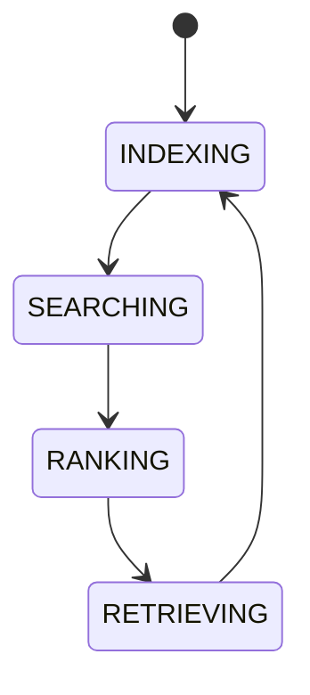

# AI Knowledge Index

## Document type
Document type: [CONTRACT]

## Purpose
Defines how AI searches the knowledge graph, indexes documents, ranks retrieval results, and applies embedding strategies if added later.

## Indexing rules
- Canonical knowledge sources are indexed with priority: canonical specs, registries, and owner documents rank above navigation and reference material.
- Documents are indexed with their document ID, path, domain, class, and authority so retrieval can honor canonical-source discipline.
- De-duplication is enforced by document ID; a moved or renamed document is re-indexed under its stable ID.

## Retrieval and ranking
- Retrieval ranks results by relevance, freshness, and canonical priority.
- Stale results are demoted; a result older than the freshness window is flagged.
- Retrieval never invents sources: a result must resolve to a real indexed document.

## State machine

## Lifecycle model
- Initial state: `INDEXING` — sources are enumerated and indexed.
- Terminal state: none — the index continuously refreshes.
- Allowed transitions: as shown in the state machine.
- Forbidden transitions: retrieving without ranking; searching an empty or stale index.
- Recovery: a failed retrieval returns to `INDEXING` and refreshes the affected source.
- Failure: a stale or missing index is surfaced rather than silently served.

## Embedding strategy
- Embedding strategies may be added later; the hooks are defined but the strategy is pluggable.
- An embedding index must preserve the document-ID mapping used by the keyword index.

## Freshness rules
- Index freshness is tracked per source; a stale index entry is flagged, never served as current.
- De-duplication is enforced by document ID; a rename re-indexes without creating a duplicate.
- Retrieval demotes stale results and never fabricates a source that is not in the index.

## Cross-references
- `../../data/knowledge/knowledge-graph.md`
- `../memory/ai-memory-system.md`
- `../../data/knowledge/context-builder.md`

## Interface Contract
Defines indexing, ranking, retrieval, embedding strategy hooks, and document search semantics.

## Example
A planner prompt retrieves strategy docs, market notes, and memory summaries ranked by relevance and canonical priority.
