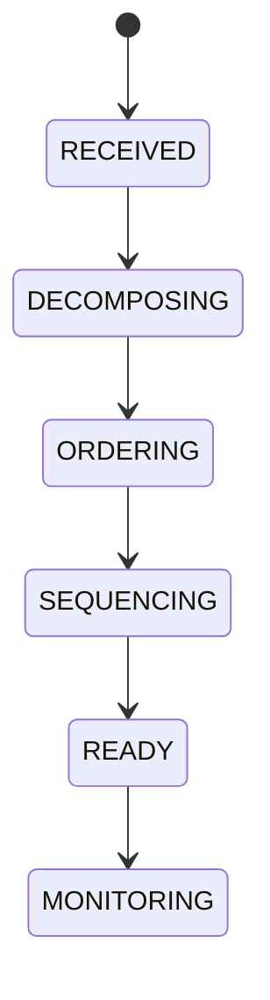

# Ai Planner

## Document type
This document is an overview, reference, or index as noted below.

# AI Planner

## Purpose
Defines the planner agent contract for goal decomposition, dependency ordering, execution sequencing, and failure recovery.

## State machine

## Cross-references
- `./ai-orchestration.md`
- `../../execution/risk-policy/decision-engine.md`
- `./ai-consensus.md`

## Operational Contract
Defines goal decomposition, dependency ordering, sequencing, recovery, and plan emission.

## Example
The planner breaks a multi-step execution request into risk, simulation, and trade tasks.

## Planning rules
- Define plan generation, plan revision, and plan validation.
- Define how plans are rejected when constraints are violated.
