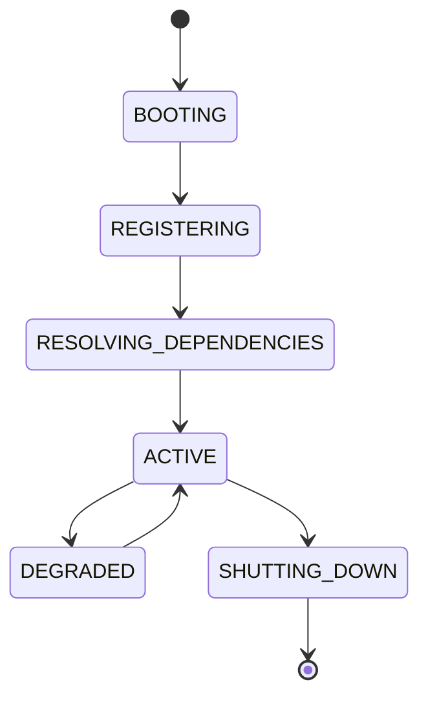

# Apex Kernel

## Document type
Document type: [CONTRACT]

## Version
**Version:** 1.0.0 | **Status:** Canonical | **Last Updated:** 2026-07-29 | **Owner:** Runtime Team

## Authority Boundary

**This document is the kernel canonical specification.**

- **Owns:** Kernel lifecycle, event infrastructure, service registration, plugin loading, health monitoring, dependency injection, configuration loading.
- **Does NOT own:** Runtime sequencing (owned by Orchestrator), flow definitions (owned by Runtime Flow Lifecycle), state semantics (owned by State Management), component state machines (owned by respective components).
- **Authority level:** Canonical — subordinate to `architecture.md` and `apex-os.md`, superior to `orchestrator.md` for kernel-internal behavior.
- **Superordinate documents:**
  - `apex-os.md` — Platform constitution
  - `architecture.md` — Whole-system architecture
- **Subordinate documents:**
  - `orchestrator.md` — Runtime sequencing (uses kernel event infrastructure)
  - `runtime-flow-lifecycle.md` — Named flows (executed on kernel infrastructure)
  - `state-management.md` — State persistence (uses kernel services)

**Authority hierarchy position:**
```
APEX OS → Architecture → APEX Kernel (this doc) → Orchestrator → Runtime Flow Lifecycle → State Management
```

**This document defers to `architecture.md` for system boundaries and to `apex-os.md` for platform constitution.** It owns kernel-internal behavior and event infrastructure.

## Purpose
Defines the runtime kernel that owns service registration, lifecycle, events, health, dependency injection, configuration, and plugin loading.

## State machine


## Responsibilities
The kernel is the root coordination layer beneath the UI, orchestrator, workers, strategies, AI, and blockchain adapters.

## Inputs
Startup config, plugin manifests, service registrations, health signals, and dependency declarations.

## Outputs
Registered services, lifecycle events, dependency bindings, health state, and plugin activation results.

## Failure modes
Dependency resolution failure, plugin load failure, health degradation, and configuration corruption.

## Recovery
Retry registration, isolate failed plugins, fall back to safe defaults, and alert through the observability stack.

## Cross-references
- `../runtime/orchestrator.md`
- `../interfaces/events/event-bus.md`
- `../runtime/service-registry.md`
- `../operations/monitoring/health-checks.md`
- `../plugins/plugin-sdk.md`

## Operational Contract
Defines the responsibilities, invariants, and expected behavior for this component.

## Example
An input is validated before any state-changing action.

---

## Version History

| Version | Date | Changes | Author |
|---------|------|---------|--------|
| 1.0.0 | 2026-07-29 | Added formal Document type declaration, Version block, and Version History section to satisfy [CONTRACT] compliance (`architecture-tests/validate_contracts.py`, `architecture-tests/validate_ownership.py`). Substantive content unchanged. | Runtime Team |
