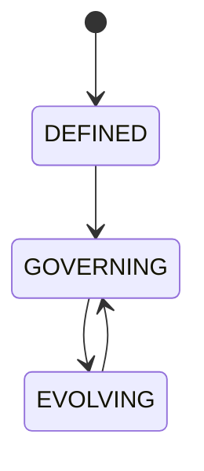

# APEX OS

## Document type
Document type: [CONTRACT]

## Purpose
Defines the constitution of the platform: vision, mission, philosophy, design principles, architecture principles, runtime principles, AI principles, security principles, extensibility principles, roadmap, non-goals, and evolution strategy.

## State machine

## Lifecycle model
- Initial state: `DEFINED` — the constitution is written and accepted.
- Terminal state: none — the constitution governs continuously and evolves.
- Allowed transitions: `DEFINED -> GOVERNING`, `GOVERNING -> EVOLVING`, `EVOLVING -> GOVERNING`.
- Forbidden transitions: any transition that bypasses `GOVERNING`, such as direct `DEFINED -> EVOLVING`.
- Recovery: an evolution that fails validation returns to `GOVERNING` without taking effect.
- Failure: a proposed evolution that violates the constitution is rejected and logged.

## Authority Boundary

**This document is the platform constitution.**

- **Owns:** Vision, mission, philosophy, design principles, architecture principles, runtime principles, AI principles, security principles, extensibility principles, roadmap, non-goals, and evolution strategy.
- **Does NOT own:** Implementation details, subsystem behavior, runtime coordination, state management, or operational procedures.
- **Authority level:** Canonical — all other architecture documents must align with this constitution.
- **Subordinate documents:**
  - `architecture.md` — Whole-system architecture reference
  - `apex-kernel.md` — Kernel lifecycle and event infrastructure
  - `orchestrator.md` — Runtime sequencing and coordination
  - `runtime-flow-lifecycle.md` — Named flow definitions
  - `state-management.md` — State semantics and persistence

**This document defers to no other architecture document.** It is the root authority for platform design principles.

## Design principles
- The system is designed for multi-chain arbitrage from the start, with Polygon as the first live-network target (ADR 0004).
- Safety precedes yield: risk gates must execute before any live submission.
- Deterministic core, assisted by AI: financial calculations and final authority stay deterministic; AI advises on ranking, explanation, and configuration.
- Operator control: autonomous execution is phased and operator-approved.

## Non-goals
- This document does not define runtime sequencing, component behavior, or operational procedures.
- The platform does not promise exact fee, latency, liquidity, or provider guarantees.
- Local LLM inference is not a production configuration goal; production AI uses cloud providers.

## Cross-references
- `./apex-kernel.md`
- `../runtime/orchestrator.md`
- `../execution/risk-policy/policy-engine.md`
- `../plugins/plugin-sdk.md`
- `../windows/windows-desktop.md`
- `../operations/reliability/enterprise-operations.md`

## Operational Contract

This document is the platform constitution. Every architecture document must align with these principles; conflicts are resolved in favor of this document. Implementation, runtime, and operational behavior remain with their canonical owners.

## Example
A proposed feature that would execute trades without operator approval in Phase 1 is rejected because it violates the operator-control principle and the phased-execution roadmap.
