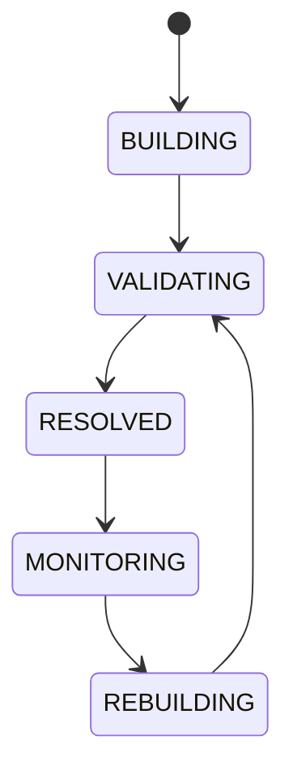

# Dependency Graph

## Document type
Document type: [CONTRACT]

## Purpose
Defines the system-wide dependency graph used for scheduling, upgrades, debugging, and safe startup ordering.

## Graph scope
Execution, simulation, risk, market data, chains, DEXs, wallets, providers, dashboards, notifications, and plugins.

## State machine

## Lifecycle model
- Initial state: `BUILDING` — the graph is assembled from registered components.
- Terminal state: `RESOLVED` — a stable, validated graph that is monitored.
- Allowed transitions: as shown in the state machine.
- Forbidden transitions: `MONITORING -> BUILDING` without going through `REBUILDING`; skipping `VALIDATING`.
- Recovery: a graph that fails validation returns to `BUILDING`; incompatible components are isolated.
- Failure: circular dependencies, missing nodes, stale edges, and incompatible versions block resolution.

## Dependency rules
- Startup ordering is derived from the graph: a component starts only after its dependencies are `RESOLVED`.
- Installer prerequisites must match the graph: an installation fails closed when a prerequisite is missing.
- A dependency failure blocks startup of the dependent component and is surfaced to the orchestrator.
- Cycle detection is mandatory: a circular edge is a resolution error, not a warning.
- Edges are versioned; a stale edge is detected when the referenced component version no longer matches.
- The graph is rebuilt when services register, upgrade, or retire; rebuilds re-run validation.

## Failure modes
Circular dependency, missing node, stale edge, incompatible version.

## Recovery
Break cycles through explicit ownership, reload graph, and isolate incompatible components.

## Cross-references
- `./architecture.md`
- `./apex-architecture.md`
- `../runtime/service-registry.md`
- `../runtime/orchestrator.md`

## Operational Contract

This document owns the dependency-graph model and its resolution rules. Runtime service registration is owned by `service-registry.md`; the graph consumes the registry. This document does not own component behavior.

## Example
A worker that depends on the risk engine and market data starts only after both are resolved; if the risk engine fails to resolve, the worker is not started.
