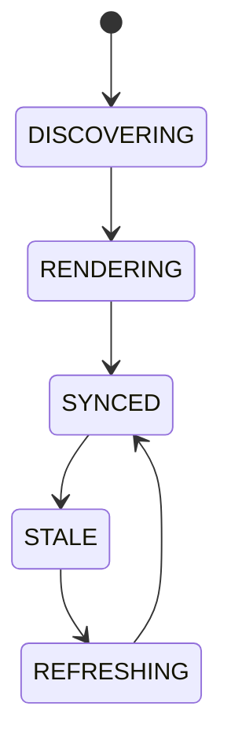

# Live Architecture Viewer

## Document type
Document type: [CONTRACT]

## Purpose
Defines the authoritative live topology and runtime visualization layer for modules, queues, events, and health.

## Scope
Strategies, workers, AI, chains, DEXs, wallets, providers, queues, and event routes.

## State machine

## Lifecycle model
- Initial state: `DISCOVERING` — topology sources are enumerated.
- Terminal state: `SYNCED` — the viewer reflects the live runtime state.
- Allowed transitions: as shown in the state machine.
- Forbidden transitions: `STALE -> RENDERING` without refresh; rendering before discovery completes.
- Recovery: stale or failed renders return to `REFRESHING` and fall back to the cached graph.
- Failure: missing nodes, invalid edges, and render failures surface as stale-viewer alerts.

## Topology sources
- Kernel registrations, service registry, dependency graph, health checks, event routes, and queue states.
- The viewer renders live module, queue, event, and health topology for the dashboard.

## Refresh rules
- Topology refreshes from the kernel on a fixed interval and on change events.
- Registries are requeried on refresh; a requery failure falls back to the last cached graph.
- A stale graph older than the configured freshness window is rendered as stale, not as current.

## Failure modes
Stale graph, missing node, invalid edge, render failure.

## Recovery
Refresh topology from kernel, requery registries, and fall back to cached graph.

## Cross-references
- `./apex-kernel.md`
- `./dependency-graph.md`
- `../operations/monitoring/health-checks.md`
- `../dashboard/ui-dashboard-spec.md`

## Operational Contract

This document owns the live topology visualization layer. It consumes kernel registrations and the dependency graph but does not own them; it renders their state for operators. Rendering must never be treated as authoritative runtime state — the kernel remains the source of truth.

## Example
When a worker retires, the viewer detects the change event, requeries the registry, and refreshes the rendered topology within the refresh window.
