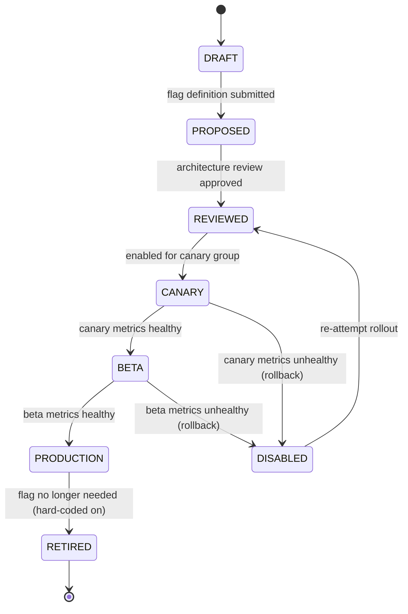

# Feature Flag Governance and Rollout Matrix

## Document type
Document type: [CONTRACT]

## Version
**Version:** 1.0.0 | **Status:** Canonical | **Last Updated:** 2026-07-27 | **Owner:** Config Team

## Purpose
Defines the complete feature-flag governance and rollout matrix — flag lifecycle, rollout policies, gating rules, dependency tracking, rollback procedures, and observability for every feature flag in the platform.

---

## 1. Feature Flag Lifecycle



| State | Description | Visibility | Rollout % | Duration Before Next State |
|-------|-------------|------------|-----------|---------------------------|
| **DRAFT** | Flag defined but not yet submitted for review | Developer only | 0% | — |
| **PROPOSED** | Flag submitted for architecture review | Team leads | 0% | Review SLA: 2 business days |
| **REVIEWED** | Flag approved for canary deployment | Canary users | 0% | — |
| **CANARY** | Flag enabled for canary group (opt-in) | Canary channel users | 10% | 2 hours minimum observation |
| **BETA** | Flag enabled for beta channel | Beta channel users | 50% | 24 hours minimum observation |
| **PRODUCTION** | Flag enabled for all production users | All users | 100% | Until retired |
| **DISABLED** | Flag disabled due to unhealthy metrics | None | 0% | Investigation; may re-attempt |
| **RETIRED** | Flag removed; behavior hard-coded as default | None | 100% (hard-coded) | — |

---

## 2. Feature Flag Inventory

| Flag | Default | Category | Dependencies | Rollout State | Gate Check | Owner |
|------|---------|----------|-------------|---------------|------------|-------|
| `feature.ai.enabled` | `true` | AI | — | Production | Health: AI provider available | AI Team |
| `feature.ai.tool_invocation` | `true` | AI | `feature.ai.enabled` | Production | AI provider functional | AI Team |
| `feature.ai.streaming` | `true` | AI | `feature.ai.enabled`, `feature.ai.tool_invocation` | Beta | Provider supports streaming | AI Team |
| `feature.ai.memory_injection` | `true` | AI | `feature.ai.enabled` | Production | Memory store initialized | AI Team |
| `feature.ai.reflection` | `false` | AI | `feature.ai.enabled`, `feature.ai.memory_injection` | Canary | AI pipeline functional | AI Team |
| `feature.trading.auto_execute` | `true` | Trading | — | Production | Risk engine loaded | Trading Team |
| `feature.trading.multi_leg` | `true` | Trading | `feature.trading.auto_execute` | Production | Wallet ready; RPC available | Trading Team |
| `feature.trading.simulation_mode` | `false` | Trading | `feature.trading.auto_execute` | Canary | Simulation engine initialized | Trading Team |
| `feature.plugin.auto_update` | `false` | Plugin | `plugin.enabled` | Canary | Marketplace reachable | Plugin Team |
| `feature.plugin.marketplace` | `false` | Plugin | `plugin.enabled` | Canary | Marketplace API available | Plugin Team |
| `feature.dashboard.live_preview` | `false` | Dashboard | `dashboard.enabled` | Canary | Dashboard rendering pipeline | Dashboard Team |
| `feature.event.exactly_once_delivery` | `true` | Event | `event.enabled` | Production | Event bus functional | Runtime Team |
| `feature.security.hardened_isolation` | `true` | Security | — | Production | Trust boundary enforcer loaded | Security Team |
| `feature.windows.service_mode` | `true` | Windows | — | Production | SCM registration confirmed | Windows Team |
| `feature.windows.tray_mode` | `true` | Windows | — | Production | Tray icon functional | Windows Team |
| `feature.windows.auto_restart` | `true` | Windows | `feature.windows.service_mode` | Production | SCM configured | Windows Team |

---

## 3. Rollout Policies

| Channel | Rollout % | Duration | Success Criteria | Rollback Trigger | Override |
|---------|-----------|----------|------------------|------------------|----------|
| **Canary** | 10% of users (opt-in) | 2 hours minimum | No Critical/High errors; P99 latency within 2× baseline; no health score drop > 0.1 | 1 Critical error OR 2 High errors OR P99 > 3× baseline | Architecture owner can force-advance |
| **Beta** | 50% of users | 24 hours minimum | Same as canary but for 24h | Same thresholds; more data points | Architecture owner can force-advance |
| **Production** | 100% of users (gradual: 10→50→100 over 4 hours) | 7 days rollback window | No degradation | 1 Critical error OR daily loss exceeds limit | Emergency rollback: set to 0% immediately |

### Gradual Production Rollout
```
1. Set rollout to 10% → monitor for 2 hours.
2. Set rollout to 50% → monitor for 2 hours.
3. Set rollout to 100% → production rollout complete.
4. Rollback window: 7 days (can still set to 0% if issues found).
5. After 7 days: flag considered stable; may be retired in next release.
```

---

## 4. Dependency Tracking

Feature flags may depend on other flags. A flag cannot be enabled unless ALL dependencies are enabled.

```
feature.ai.streaming depends on:
  - feature.ai.enabled (must be true)
  - feature.ai.tool_invocation (must be true)

feature.trading.multi_leg depends on:
  - feature.trading.auto_execute (must be true)

feature.plugin.marketplace depends on:
  - plugin.enabled (config key, must be true)
```

### Enforcement
- Config Manager validates flag dependencies on every change.
- If a flag is enabled but a dependency is disabled → config validation error → flag stays disabled.
- Log dependency violation with offending flag and missing dependency.

---

## 5. Rollback Procedures

| Rollback Type | Procedure | Time Budget | Notification |
|---------------|-----------|-------------|--------------|
| Canary rollback | Set flag to 0%; canary users revert immediately | < 1 min | Canary users see "Feature reverted" message |
| Beta rollback | Set flag to 0%; beta users revert on next config poll | < 5 min | Beta notification channel |
| Production rollback | Set rollout to 0% → all clients get downgrade update | < 15 min | All channels; emergency notification |
| Emergency rollback | Immediate 0% + force config reload event | < 30s | All channels; operator paged |

---

## 6. Observability

| Event | Trigger | Payload |
|-------|---------|---------|
| `feature.flag.changed` | Flag state transition | `{flag_name, old_state, new_state, rollout_percent, changed_by}` |
| `feature.flag.rollout.progress` | Gradual rollout step | `{flag_name, step, percent, metrics_snapshot}` |
| `feature.flag.rollback` | Rollback triggered | `{flag_name, rollback_reason, metrics_snapshot}` |
| `feature.flag.dependency_violation` | Dependency check fails | `{flag_name, missing_dependency}` |

---

## Cross-References

- **FEATURE-FLAGS.md** — Feature flag definitions (authoritative for flag catalog).
- **FEATURE-GATES.md** — Feature gate governance (authoritative for gating rules).
- **CONFIGURATION-REFERENCE.md** — `feature.*` config keys.
- **CONFIGURATION-PROFILES.md** — Profile-based feature flag overrides.
- **TRACEABILITY-MATRIX.md** — Feature flag requirement coverage.

---

## Version History

| Version | Date | Changes | Author |
|---------|------|---------|--------|
| 1.0.0 | 2026-07-27 | New: complete feature flag governance with lifecycle, inventory, rollout matrix, dependency tracking, rollback procedures | Config Team |
