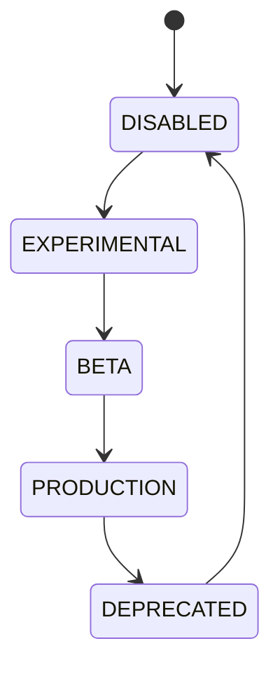

# Feature Flags

## Document type
This document is an overview, reference, or index as noted below.

## Purpose
Defines controlled rollout states for all product capabilities.

## States
Experimental, Beta, Production, Deprecated, Disabled.

## State machine

## Failure modes
Unsafe rollout, invalid default, conflicting environment override.

## Recovery
Rollback, disable, or pin to previous version.

## Rollout rules
- A flag is promoted only after the previous state is validated in the target environment.
- Environment overrides are scoped and audited.
- A flag default must be safe: new capabilities default to `Disabled` or `Experimental`.
- Deprecated flags are retired on a defined schedule.

## Overrides
- Environment overrides must not silently conflict with the configured state.
- A conflicting override is rejected and logged.

## Rollout controls
- A flag promotes through states only after the previous state is validated in the target environment.
- Environment overrides are scoped per environment and audited; a conflicting override is rejected and logged.
- New capabilities default to `Disabled` or `Experimental`; a production-safe default is required for any flag.
- Deprecated flags are retired on a defined schedule and removed from the surface at the removal target.
- Flag evaluation is deterministic: the same state, environment, and overrides produce the same result.
- A flag cannot gate a safety-critical path without a documented risk owner.

## Cross-references
- `../core/configuration.md`
- `../../execution/risk-policy/policy-engine.md`
- `../../deployment/versioning.md`

## Operational Contract
This document owns flag states, rollout gating, and environment overrides. Configuration precedence is owned by the configuration system; this document defines how flags gate capability availability.

## Example
A new capability ships `Experimental` by default and reaches `Production` only after the previous state is validated in the target environment; a conflicting override is rejected and logged.
