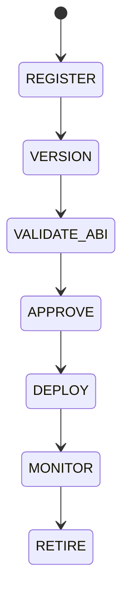

# Contract Management

## Version
**Version:** 1.1.0 | **Status:** Canonical | **Last Updated:** 2026-08-02 | **Owner:** Runtime Team

## Document type
This document is an overview, reference, or index as noted below.

# Contract Management

## Purpose
Defines registry-based contract storage, ABI versioning, governance approval, deployment selection, and retirement.

## State machine

## Governance
New deployments are selected via configuration and governance approval, not automatic rotation.

## Configuration
- DEPLOYMENT_WHITELIST.
- MIN_APPROVALS.
- ABI_STORAGE_PATH.

## Security
Must be secured with multi-sig and emergency pause controls.

## Deployment control
- Deployment selection is governance-gated; no deployment is rotated automatically.
- A retired contract is removed from active selection only after approval.

## Cross-references
- `../../security/security-contracts.md`
- `../../market/chains/chain-registry.md`
- `../../runtime/orchestrator.md`

## Governance Rules
Defines contract lifecycle handling, deployment references, upgrades, deprecation, and address safety.

## Operational Contract
Defines the authoritative lifecycle for on-chain contract artefacts owned by APEX: registration in `./contract-registry.md`, semantic ABI versioning, governance-gated approval before deployment selection, monitored deployment, and controlled retirement. No deployment is selected automatically — every transition from `APPROVE` to `DEPLOY` requires the configured `MIN_APPROVALS` governance approvals recorded against the entry in `ABI_STORAGE_PATH`.

## Example
A proxy upgrade is recorded before the implementation address changes.

---

## Version History

| Version | Date | Changes | Author |
|---------|------|---------|--------|
| 1.1.0 | 2026-08-02 | Expanded canonical content: replaced placeholder directives and generic boilerplate with grounded ownership, rules, lifecycle, failure, and cross-reference detail. | Runtime Team |
| 1.0.1 | 2026-07-29 | Added `## Operational Contract` section (state-machine-consistent authoritative contract body) to satisfy [CONTRACT] compliance (`architecture-tests/validate_contracts.py`). All other content unchanged. | Runtime Team |
| 1.0.0 | 2026-07-29 | Added formal Document type declaration, Version block, and Version History section to satisfy [CONTRACT] compliance (`architecture-tests/validate_contracts.py`, `architecture-tests/validate_ownership.py`). Substantive content unchanged. | Runtime Team |
