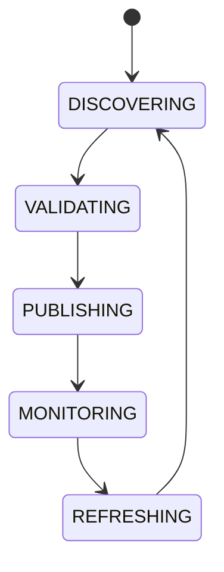

# System Capability Registry

## Document type
This document is an overview, reference, or index as noted below.

# System Capability Registry

## Purpose
Defines platform-wide capability discovery independent of implementation names.

## Examples
Supports Flash Loans, Permit2, Cross-Chain, Streaming AI, Vision Models, Tool Calling, Batch Execution.

## State machine

## Failure modes
Wrong capability label, stale capability, incompatible version.

## Recovery
Re-scan adapters, revalidate manifests, and suspend stale capabilities.

## Capability discovery
- Capabilities are discovered by scanning adapters and validating manifests.
- A capability label must map to a real implementation; an unbacked label is suspended.
- Capability versions are checked for compatibility before use.
- A stale or wrong capability label is never served as current.

## Cross-references
- `../../data/registries/registry-system.md`
- `../../plugins/plugin-sdk.md`
- `../../ai/providers/ai-provider-manager.md`
- `../../ai/runtime/ai-gateway.md`

## Capability rules
- Capabilities are discovered by scanning adapters and validating manifests; a label without a backing implementation is suspended.
- Capability versions are checked for compatibility before use; an incompatible version blocks the feature.
- Feature flags gate capability exposure; a disabled flag blocks the capability from consumers.
- Ownership and versioning are recorded per capability; a stale capability is never served as current.
- Capability checks run before a feature is enabled; an unsupported feature is blocked with a clear reason.
- A capability is refreshed on a defined cadence and on adapter change events.
- A suspended capability is revalidated before it can be re-published.
- Capability discovery failures are logged and surfaced to operators.

## Canonical ownership
This document defers to the canonical owners for implementation, policy, and schema details.
