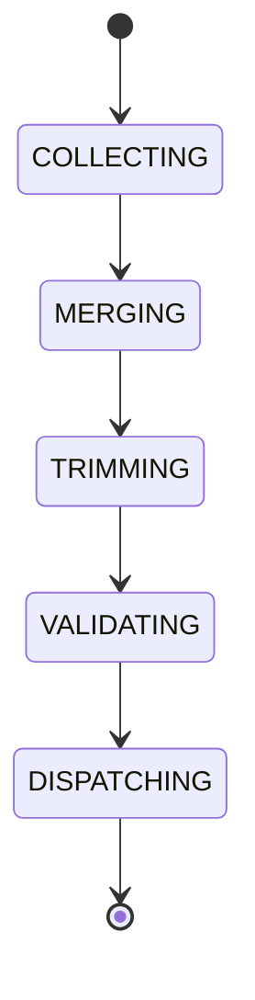

# Context Builder

## Document type
Document type: [CONTRACT]

## Purpose
Defines the component that assembles structured context before every AI request.

## Pipeline
Memory -> Knowledge Graph -> Current Market -> User Settings -> Runtime State -> Decision History -> Prompt Builder -> AI Gateway.

## Context sources
- **Memory** — curated memory scopes relevant to the task.
- **Knowledge graph** — canonical knowledge and registries.
- **Current market** — live prices, pools, and chain state.
- **User settings** — profile and preferences.
- **Runtime state** — health, workers, providers, and balances.
- **Decision history** — recent decisions and outcomes.
- **Windows signals** — tray, service, and notification state where relevant.

## Assembly rules
- Sources are collected in pipeline order and merged into a single structured context.
- Context is trimmed to fit the model window; oversize context is compressed, not silently truncated.
- Context is validated before dispatch; a request with invalid or stale runtime state is refused.
- Only context required for the task is injected; sensitive data is redacted per policy.

## State machine

## Failure modes
Missing memory, oversize context, invalid source, stale runtime state.

## Recovery
Compress context, fall back to curated memory, or refuse dispatch if policy fails.

## Cross-references
- `../../ai/runtime/ai-pipeline.md`
- `../../ai/memory/ai-memory-system.md`
- `./knowledge-graph.md`
- `../../ai/runtime/ai-gateway.md`

## Operational Contract

Defines how user, market, wallet, and runtime context are assembled for downstream reasoning. The context builder composes sources; each source remains owned by its canonical owner.

## Example
A prompt includes live balances, active positions, and current chain state, trimmed to the model window before dispatch.
