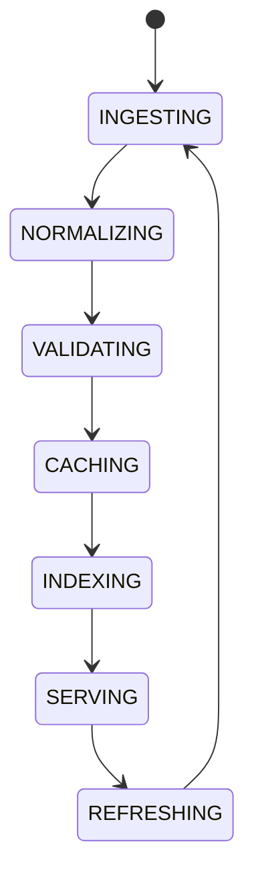

# Data Governance

## Document type
Document type: [CONTRACT]

## Purpose
Defines the central owner for data normalization, validation, provenance, caching, and graph linking.

## Scope
Market data, token metadata, chain metadata, DEX metadata, AI knowledge, execution history, and analytics inputs.

## Governance rules
- Every record carries provenance: source, ingest timestamp, and lineage.
- A record without valid provenance is rejected at validation, never silently dropped.
- Data quality is enforced at the boundary: invalid, stale, or incompatible records fail closed.
- Retention and access control follow the data ownership map and the security model.
- Graph linking is governed: nodes and edges are validated before serving.

## State machine

## Windows storage governance
- User data uses `%APPDATA%`; service data uses `%PROGRAMDATA%`.
- Sensitive stored data is encrypted at rest; backups follow the retention schedule.
- Storage, retention, encryption, and audit behavior are defined per data domain.

## Failure modes
Invalid source, stale cache, broken provenance, incompatible schema.

## Recovery
Reject invalid records, refresh from source, and replay lineage from durable storage.

## Cross-references
- `../../market/core/market-data.md`
- `./knowledge-graph.md`
- `./data-ownership.md`
- `../../ai/memory/ai-memory-system.md`
- `../registries/registry-system.md`

## Governance Rules
Defines data quality, lineage, retention, access control, and stewardship expectations.

## Example
A market dataset is rejected if provenance is missing; a valid dataset is cached, indexed, and served with its lineage intact.
