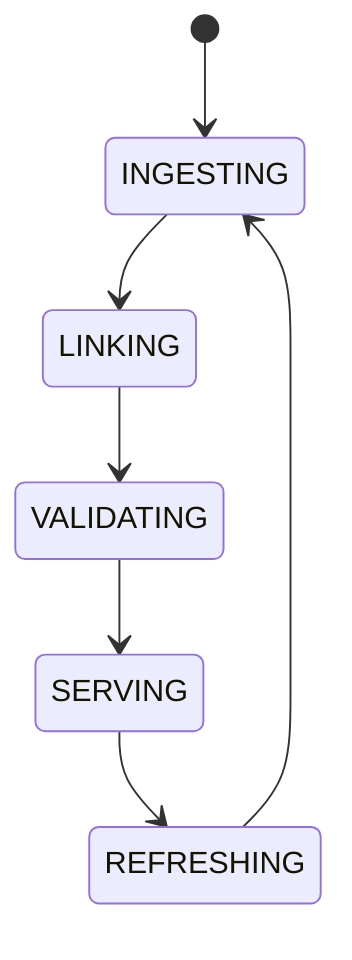

# Knowledge Graph

## Document type
Document type: [CONTRACT]

## Purpose
Defines the structured graph linking protocols, tokens, strategies, chains, DEXs, risks, and AI agents.

## Node types
- Protocol nodes (chains, DEXs, oracles, tokens).
- Strategy nodes.
- Risk nodes (policies, limits).
- Execution nodes (transactions, positions).
- AI agent nodes (agents, memory scopes).

## Edge rules
- Edges express typed relations (links-to, depends-on, risks, executed-by).
- A duplicate entity or invalid relation is rejected at validation.
- Stale nodes and broken edges are detected and isolated, not served.
- Version drift between linked entities is flagged and reconciled.

## Update propagation
- Source changes propagate through the graph on ingest and refresh.
- A refresh revalidates relations before serving.
- Serving never returns a stale subgraph as current.

## State machine

## Failure modes
Stale node, broken edge, duplicate entity, invalid relation, version drift.

## Recovery
Refresh source nodes, revalidate relations, and isolate stale subgraphs.

## Cross-references
- `../../ai/memory/ai-memory-system.md`
- `../../market/chains/chain-intelligence.md`
- `../../market/core/market-intelligence.md`
- `../../interfaces/api/domain-model.md`

For data governance, see `./data-governance.md`.

## Governance Rules
Defines node types, edges, indexing, update propagation, and retrieval semantics for the knowledge graph.

## Example
A strategy node links to market regime, risk policy, and execution history; a stale relation is isolated rather than served.
