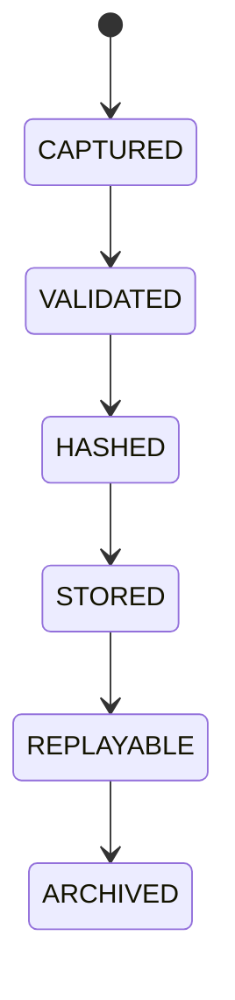

# Decision Ledger

## Document type
Document type: [CONTRACT]

## Purpose
Defines the immutable record of every autonomous decision and outcome.

## State machine

## Required fields
- Unique Decision ID.
- Timestamp.
- Trigger event.
- Market snapshot.
- AI recommendation.
- Deterministic calculations.
- Policy evaluation.
- Risk score.
- Simulation result.
- Final decision.
- Execution result.
- Post-execution outcome.

## Ledger Semantics
Defines the immutable trace of autonomous decisions, simulation outputs, execution results, and outcomes.

## Integrity rules
- Records are hash-chained; a tampered record is detected on read and flagged.
- A record missing required fields or with incomplete lineage is rejected, not partially stored.
- Replays must reproduce the recorded decision deterministically; a replay mismatch escalates to audit.
- Archived records remain readable but are excluded from live replay.

## Failure modes
Missing record, tampered record, incomplete lineage, replay mismatch.

## Recovery
Rebuild from source logs, reject incomplete traces, escalate to audit.

## Cross-references
- `../../execution/risk-policy/decision-engine.md`
- `../../ai/explainability/governance-explainability.md`
- `../../ai/explainability/explainability.md`
- `../../execution/decision-log.md`

## Operational Contract

This document owns the immutable decision ledger. The decision engine produces decisions; the ledger records them with lineage. Nothing may mutate a stored record.

## Example
A trade decision records market snapshot, risk score, and post-execution outcome, hash-chained to the prior record.
