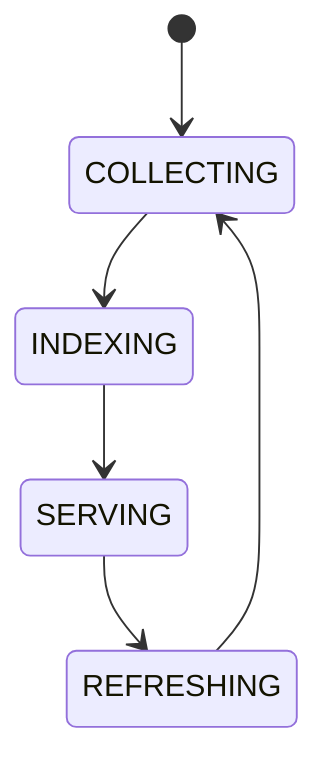

# Runtime Knowledge

## Document type
Document type: [CONTRACT]

## Purpose
Defines what the running system knows about itself at runtime.

## Contents
- Active chains.
- Loaded plugins.
- Running workers.
- Connected wallets.
- Provider capabilities.
- Health state.
- Runtime metrics.

## Collection rules
- Runtime knowledge is collected from the kernel, registries, health probes, and the event stream.
- Stale knowledge is never served as current; a refresh failure surfaces the staleness.
- The service view is consistent: dashboard, tray, and service surfaces read the same state.

## Windows runtime context
- Service state, tray state, and Windows notification visibility are derived from runtime knowledge.
- Runtime knowledge survives restarts by rehydrating from persisted kernel state.

## State machine

## Failure modes
Stale knowledge, missing runtime state, inconsistent service view.

## Recovery
Refresh from kernel, registries, health probes, and event stream.

## Cross-references
- `../../architecture/apex-kernel.md`
- `../../operations/monitoring/health-checks.md`
- `../../operations/monitoring/monitoring-observability.md`
- `../../dashboard/dashboard-workspaces.md`

## Operational Contract

Defines the live system view of active chains, plugins, workers, wallets, provider capabilities, health, and metrics. The kernel owns runtime state; this document owns the knowledge view of it.

## Example
The dashboard reads runtime knowledge to show active workers and healthy providers; a stale worker entry is shown as stale, not active.
