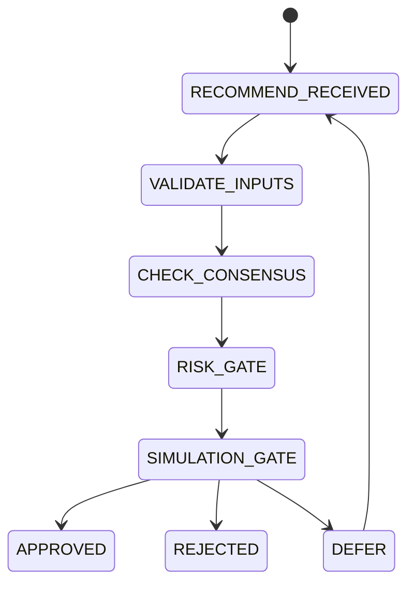

# Decision Engine

## Document type
Document type: [CONTRACT]

## Version
**Version:** 1.1.0 | **Status:** Canonical | **Last Updated:** 2026-08-02 | **Owner:** Trading Team

## Purpose
Defines the authoritative gatekeeper between recommendation and execution.

## State machine

## Veto hierarchy
- Risk Agent can veto.
- Planner can override only with 2/3 consensus.
- Human override via dashboard always wins.

## Timeout
Decisions expire after `DECISION_TTL_SECONDS` unless executed.

## Failure Handling

The Decision Engine fails closed. No failure path may produce an `APPROVED`
outcome; when the engine cannot establish that a recommendation is safe, the
recommendation does not execute.

| Failure | Detection | Outcome |
| --- | --- | --- |
| Input validation fails | `VALIDATE_INPUTS` rejects a malformed or incomplete recommendation | Transition to `REJECTED`; the recommendation is discarded and the reason recorded |
| Consensus unavailable | `CHECK_CONSENSUS` cannot reach the required agent quorum | Transition to `DEFER`; the recommendation re-enters `RECOMMEND_RECEIVED` until its TTL expires |
| Risk gate unavailable | `RISK_GATE` cannot obtain a verdict from the Risk Engine | Treated as a veto, not as an absent objection; transition to `REJECTED` |
| Simulation gate unavailable | `SIMULATION_GATE` cannot obtain a simulation result | Transition to `DEFER`; execution is withheld pending a usable result |
| Decision TTL expires | Age exceeds `DECISION_TTL_SECONDS` before execution | The decision is void; a stale decision is never executed against current market state |
| Policy read fails | Policy Engine cannot supply a required threshold | Transition to `REJECTED`; no implicit default threshold is substituted |

Failure outcomes are recorded on the same decision-logging path as successful
outcomes, so that a rejected or deferred decision remains replayable. Repeated
`DEFER` outcomes for the same recommendation are surfaced to the Windows UI
rather than retried silently.

## Cross-references
- `../../ai/orchestration/ai-consensus.md`
- `./risk-engine.md`
- `../../runtime/orchestrator.md`
- `../trading/trading-lifecycle.md`

## Operational Contract
Defines the authoritative gatekeeper between recommendation and execution, including veto hierarchy and timeouts.

## Example
An AI recommendation is blocked when policy or risk gates fail.

## Approval flow
- Must define how approval or veto is surfaced to the Windows UI.

## Required details
- Define UI approval and veto wiring.

## Decision rules
- Define approval, veto, and notification flow to the Windows UI.
- Define how decision outcomes are logged and replayed.

---

## Version History

| Version | Date | Changes | Author |
|---------|------|---------|--------|
| 1.1.0 | 2026-08-02 | Added Failure Handling section defining fail-closed behaviour for validation, consensus, risk-gate, simulation-gate, TTL, and policy-read failures. | Trading Team |
| 1.0.0 | 2026-07-29 | Added formal Document type declaration, Version block, and Version History section to satisfy [CONTRACT] compliance (`architecture-tests/validate_contracts.py`, `architecture-tests/validate_ownership.py`). Substantive content unchanged. | Trading Team |
