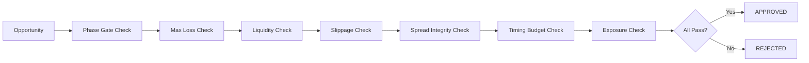

# Risk Engine

## Document type
Document type: [CONTRACT]

## Version
**Version:** 2.0.0 | **Status:** Canonical | **Last Updated:** 2026-08-01 | **Owner:** Trading Team

## Purpose
Defines trading risk checks used before and during execution — with explicit formulas, limits, circuit breakers, and abort behavior for all MVP phases.

**CRITICAL: Risk engine has VETO AUTHORITY in all phases. Phase 1 enforces hard blocks on live execution. No trade bypasses risk checks.**

---

## 0. MVP Phase Behavior

### Phase 1 — Simulation Only (CURRENT)
**Risk Mode:** HARD_BLOCK | **Live Execution:** ALWAYS_REJECTED

**Risk Engine Behavior:**
- All risk checks execute normally
- Any opportunity reaching execution gate is HARD REJECTED
- Risk engine logs: `REJECTED: PHASE_1_EXECUTION_BLOCK`
- Simulation outcomes tracked for Phase 2 eligibility

**Hard Invariants:**
```python
if execution_mode == SIMULATION_ONLY:
    if trade.attempt_live_execution:
        reject(trade, code="PHASE_1_BLOCK")
        return
```

### Phase 2 — Operator-Approved
**Risk Mode:** REDUCED_LIMITS | **Live Execution:** REQUIRES_RISK_APPROVAL

**Risk Engine Behavior:**
- All risk checks execute with 50% of Phase 3 limits
- Operator can override risk rejection (with audit trail)
- Risk engine logs all overrides
- Emergency kill switch: risk engine can pause all execution

**Reduced Limits:**
- Max loss per trade: 50% of Phase 3
- Max position size: 50% of Phase 3
- Max daily loss: 50% of Phase 3
- Max slippage: 50% of Phase 3

### Phase 3 — Autonomous
**Risk Mode:** FULL_LIMITS | **Live Execution:** AUTO_ENFORCED

**Risk Engine Behavior:**
- All risk checks execute with full limits
- No operator override (fully automated)
- Emergency kill switch: risk engine can pause all execution
- Continuous learning from execution outcomes

---

## 1. Risk Check Pipeline

Each trade opportunity passes through the risk pipeline sequentially. All checks must PASS for the trade to proceed.



**Phase 1 Special:** Even if all checks pass, execution is blocked at Phase Gate.

---

## 2. Risk Check Definitions

### 2.0 Phase Gate Check
**Purpose:** Enforce MVP phase boundaries

**Phase 1:**
```
condition: execution_mode == SIMULATION_ONLY
action: REJECT with code="PHASE_1_EXECUTION_BLOCK"
```

**Phase 2:**
```
condition: operator_approval == true AND risk_score >= threshold
action: APPROVE with audit trail
```

**Phase 3:**
```
condition: risk_score >= threshold
action: AUTO_APPROVE
```

### 2.1 Max Loss Check
**Purpose:** Ensure worst-case loss does not exceed configured limit.

**Formula:**
```
estimated_loss_usd = position_size_usd × max_adverse_movement_pct
condition: estimated_loss_usd <= risk.max_loss_per_trade_usd
```

**Phase Limits:**
- Phase 1: N/A (execution blocked)
- Phase 2: `risk.max_loss_per_trade_usd = 25.00` (50% of Phase 3)
- Phase 3: `risk.max_loss_per_trade_usd = 50.00`

**Failure action:** REJECT with code `LOSS_LIMIT_EXCEEDED`.

### 2.2 Liquidity Check
**Purpose:** Ensure DEX pools have sufficient depth for the trade size.

**Formula:**
```
condition: trade_size_usd <= pool_liquidity_usd × risk.max_liquidity_usage_pct
default:   risk.max_liquidity_usage_pct = 0.05 (5%)
source:    On-chain pool query
```

**Failure action:** REJECT with code `LIQUIDITY_INSUFFICIENT`.

### 2.3 Slippage Check
**Purpose:** Ensure slippage does not exceed acceptable threshold.

**Formula:**
```
estimated_slippage_pct = (expected_output - minimum_output) / expected_output
condition: estimated_slippage_pct <= risk.max_slippage_pct
```

**Phase Limits:**
- Phase 1: N/A (simulation only)
- Phase 2: `risk.max_slippage_pct = 0.005` (0.5%)
- Phase 3: `risk.max_slippage_pct = 0.01` (1.0%)

**Failure action:** REJECT with code `SLIPPAGE_EXCEEDED`.

### 2.4 Spread Integrity Check
**Purpose:** Detect manipulated or stale prices.

**Formula:**
```
price_deviation_pct = |dex_price - oracle_price| / oracle_price
condition: price_deviation_pct <= risk.max_price_deviation_pct
default:   risk.max_price_deviation_pct = 0.02 (2%)
```

**Failure action:** REJECT with code `PRICE_INTEGRITY_FAIL`.

### 2.5 Timing Budget Check
**Purpose:** Ensure execution can complete before opportunity expires.

**Formula:**
```
estimated_execution_time_ms = network_latency + gas_estimation + signing + broadcast
opportunity_expiry_ms = time_until_arb_window_closes
condition: estimated_execution_time_ms < opportunity_expiry_ms × risk.timing_buffer_pct
default:   risk.timing_buffer_pct = 0.8 (80% of window)
```

**Failure action:** REJECT with code `TIMING_BUDGET_EXCEEDED`.

### 2.6 Exposure Check
**Purpose:** Ensure total portfolio exposure remains within limits.

**Formula:**
```
total_exposure_usd = sum(open_positions)
condition: total_exposure_usd + new_position_usd <= risk.max_total_exposure_usd
```

**Phase Limits:**
- Phase 1: N/A (no live positions)
- Phase 2: `risk.max_total_exposure_usd = 500.00`
- Phase 3: `risk.max_total_exposure_usd = 1000.00`

**Failure action:** REJECT with code `EXPOSURE_LIMIT_EXCEEDED`.

---

## 3. Circuit Breakers

### 3.1 Per-Trade Circuit Breaker
**Triggers:**
- 3 consecutive losses
- Loss > 2ײ average loss
- Execution failure rate > 10%

**Action:** Pause trading for 5 minutes, alert operator

### 3.2 Daily Loss Circuit Breaker
**Triggers:**
- Phase 2: Daily loss > $100
- Phase 3: Daily loss > $200

**Action:** Pause trading until next day, alert operator

### 3.3 System-Wide Circuit Breaker
**Triggers:**
- Critical subsystem failure (wallet, RPC, DEX adapter)
- Security incident detected
- Operator manual trigger

**Action:** Immediate halt of all execution, emergency shutdown

---

## 4. Risk Scoring

### 4.1 Risk Score Calculation
Each opportunity receives risk score (0.0 to 1.0):

```
risk_score = (
    liquidity_score × 0.25 +
    slippage_score × 0.20 +
    spread_score × 0.20 +
    timing_score × 0.15 +
    exposure_score × 0.10 +
    historical_success_rate × 0.10
)
```

**Thresholds:**
- Phase 2: `risk_score >= 0.7` for operator approval
- Phase 3: `risk_score >= 0.8` for auto-approval

### 4.2 Risk Score Components

**Liquidity Score:**
```
liquidity_score = min(1.0, pool_liquidity_usd / required_liquidity_usd)
```

**Slippage Score:**
```
slippage_score = 1.0 - (estimated_slippage_pct / max_slippage_pct)
```

**Spread Score:**
```
spread_score = 1.0 - (price_deviation_pct / max_deviation_pct)
```

**Timing Score:**
```
timing_score = 1.0 - (estimated_execution_time_ms / opportunity_expiry_ms)
```

---

## 5. Failure Modes

### 5.1 Risk Check Failures
- **Max loss exceeded:** Reject, log, continue scanning
- **Liquidity insufficient:** Reject, log, try smaller size
- **Slippage exceeded:** Reject, log, wait for better conditions
- **Spread integrity fail:** Reject, log, alert operator (possible manipulation)
- **Timing budget exceeded:** Reject, log, skip opportunity
- **Exposure limit exceeded:** Reject, log, wait for position closure

### 5.2 Risk Engine Failures
- **Calculation error:** Reject opportunity, log anomaly
- **Data unavailable:** Reject opportunity, retry later
- **State corruption:** Pause trading, alert operator, restore from checkpoint

---

## 6. Cross-Subsystem Contracts

### 6.1 Trading Engine
**Contract:**
- Trading engine must call risk engine before execution
- Risk engine response within 10ms
- Trading engine respects risk engine veto

### 6.2 Simulation Engine
**Contract:**
- Simulation provides risk inputs (slippage, liquidity, timing)
- Risk engine validates simulation assumptions
- Risk engine receives simulation outcomes for learning

### 6.3 Execution Engine
**Contract:**
- Execution engine reports actual outcomes to risk engine
- Risk engine can halt execution mid-trade
- Risk engine receives execution failures for learning

### 6.4 Wallet Manager
**Contract:**
- Wallet manager provides balance and exposure data
- Risk engine enforces exposure limits
- Wallet manager respects risk engine blocks

---

## Cross-references
- `../trading/trading-engine.md` — trading lifecycle and execution
- `../simulation/simulation-engine.md` — simulation validation
- `../transactions/execution-engine.md` — execution lifecycle
- `../../market/core/market-data.md` — price and liquidity data
- `../../operations/monitoring/metrics.md` — risk metrics
