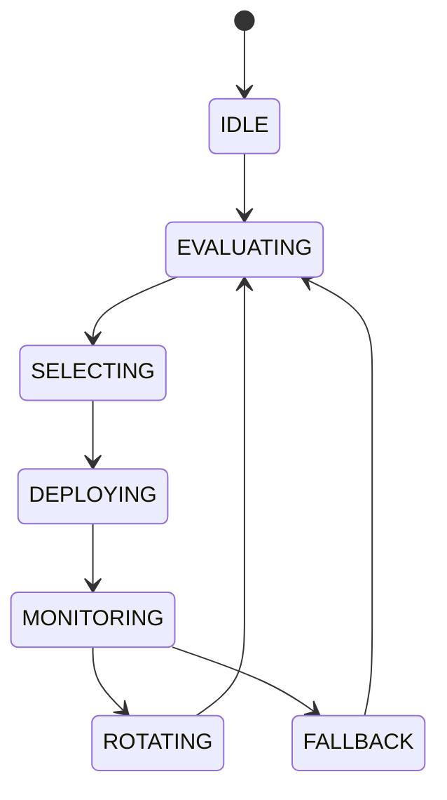

# Strategy Rotation

## Document type
Document type: [CONTRACT]

## Purpose
Defines how strategies are evaluated, selected, deployed, monitored, and rotated.

## State machine

## Lifecycle model
- Initial state: `IDLE` — no strategy is deployed.
- Terminal state: none — the rotation loop continues.
- Allowed transitions: as shown in the state machine.
- Forbidden transitions: deploying without evaluation; rotating without monitoring.
- Recovery: a strategy that fails SLO returns to `FALLBACK` and is re-evaluated.
- Failure: an SLO breach disables the strategy and alerts operations.

## Scoring
Score = configurable weighted combination of win rate, Sharpe ratio, recent performance, and regime alignment.

## Configuration
- `ENABLED_STRATEGIES`.
- `MIN_PERFORMANCE_SCORE`.
- `ROTATION_COOLDOWN_MINUTES`.

## Rotation rules
- Only enabled strategies participate; a disabled strategy is excluded from selection.
- A strategy below `MIN_PERFORMANCE_SCORE` is not selected.
- Rotation respects `ROTATION_COOLDOWN_MINUTES` to prevent thrashing.
- If a strategy fails SLO, disable it and alert through `../../operations/notifications/notification-center.md`.
- Fallback strategies keep the engine operating while primary strategies re-evaluate.

## Cross-references
- `../../runtime/orchestrator.md`
- `../../ai/orchestration/ai-consensus.md`
- `../../performance/performance-slos.md`
- `../../security/security-contracts.md`

## Operational Contract

This document owns strategy evaluation, selection, deployment, monitoring, and rotation. Individual strategy behavior is owned by the strategy owners; this document manages the set of active strategies.

## Example
A strategy that breaches its SLO is disabled and rotated out; the fallback strategy keeps scanning while it re-evaluates.
