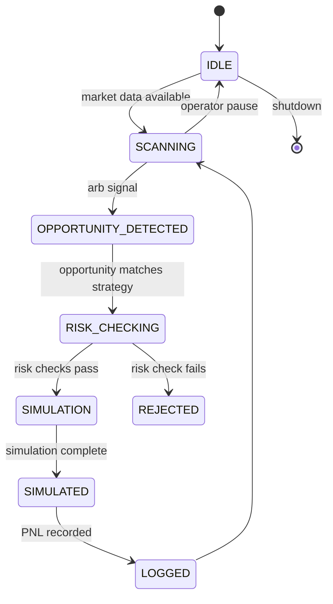
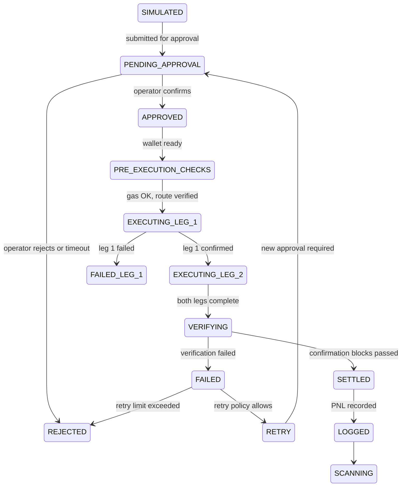
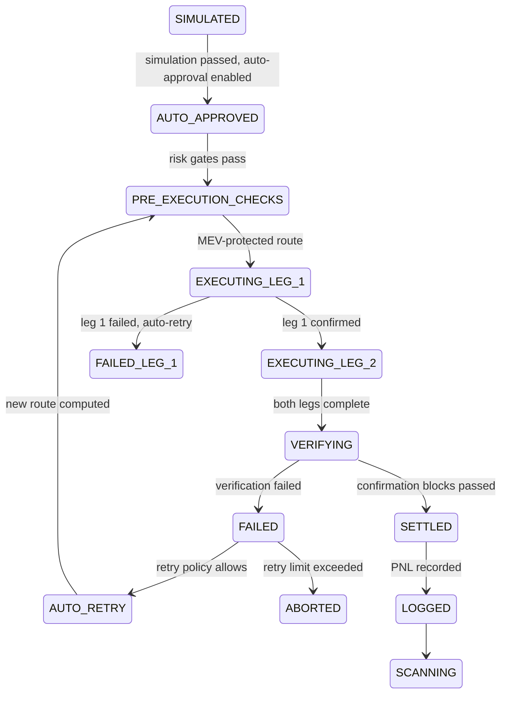

# Trading Engine

## Document type
Document type: [CONTRACT]

## Version
**Version:** 2.0.0 | **Status:** Canonical | **Last Updated:** 2026-08-01 | **Owner:** Trading Team

## Purpose
Defines the end-to-end trading decision and execution coordination layer — complete execution algorithm, order routing algorithm, risk scoring formulas, liquidity scoring, arbitrage scoring, opportunity expiry, partial fills, multi-chain execution, gas optimisation, MEV decision tree, wallet selection, retry matrices, rollback rules, position reconciliation, and cross-subsystem integration contracts.

**CRITICAL: This document defines execution behavior for all MVP phases. Phase 1 (current) is simulation-only. Live execution requires explicit phase upgrade.**

---

## 0. MVP Execution Phases

### Phase 1 — Simulation/Paper Trading (CURRENT)
**Status:** Active | **Live Execution:** DISABLED | **Operator Approval:** N/A

- All trading logic executes in simulation mode only
- No wallet signing, no transaction submission
- Full arbitrage detection, scoring, and routing
- Paper trades logged for PNL tracking and validation
- Risk engine enforces hard blocks on live execution
- Simulation engine records all outcomes for backtesting

**Hard Invariants:**
- `execution_mode = SIMULATION_ONLY`
- `wallet.signing_enabled = false`
- `rpc.broadcast_enabled = false`
- All trades must complete simulation lifecycle before Phase 2 eligibility

### Phase 2 — Operator-Approved Execution
**Status:** Pending | **Live Execution:** REQUIRES_APPROVAL | **Operator Approval:** MANDATORY

- Simulation continues with real-time market data
- Operator reviews and approves each trade via dashboard
- Manual wallet signing or operator-initiated broadcast
- Risk engine enforces reduced limits (50% of Phase 3)
- Position limits: 10% of Phase 3 maximum
- All trades require explicit operator confirmation before execution

**Upgrade Requirements:**
- 100+ successful simulated trades
- <1% simulation failure rate
- Positive simulated PNL over 7+ days
- Operator dashboard completion
- Risk engine validation

### Phase 3 — Autonomous Execution
**Status:** Future | **Live Execution:** ENABLED | **Operator Approval:** OPTIONAL

- Full autonomous execution with MEV protection
- Multi-chain arbitrage with automatic routing
- Risk engine enforces full limits
- Operator oversight via monitoring dashboard only
- Emergency kill switch always available

**Upgrade Requirements:**
- 500+ operator-approved trades (Phase 2)
- <0.5% execution failure rate
- Positive real PNL over 30+ days
- MEV protection validation
- Security audit completion

---

## 1. Trade Lifecycle State Machine

### Phase 1 (Simulation) State Machine

### Phase 2 (Operator-Approved) State Machine

### Phase 3 (Autonomous) State Machine

---

## 2. Execution Algorithm

### 2.1 Opportunity Detection
**All Phases:** Active

- Scan DEX pools across configured chains
- Identify triangular and cross-DEX arbitrage
- Calculate gross profit: `profit = (output_amount - input_amount) × price`
- Filter by minimum threshold: `profit_usd >= min_profit_threshold`

### 2.2 Risk Scoring
**All Phases:** Active

Each opportunity receives risk score based on:
- Liquidity depth: `score += liquidity_score × 0.3`
- Slippage estimate: `score += slippage_score × 0.25`
- Gas efficiency: `score += gas_score × 0.2`
- Route stability: `score += stability_score × 0.15`
- MEV risk: `score += mev_score × 0.1`

**Phase 1:** Score used for simulation ranking only
**Phase 2:** Score used for operator recommendation
**Phase 3:** Score used for auto-approval threshold

### 2.3 Route Selection
**All Phases:** Active

Select optimal route based on:
1. Highest risk-adjusted profit: `profit_risk_adjusted = profit × risk_score`
2. Lowest gas cost: `net_profit = profit - gas_cost_usd`
3. Fastest execution: `execution_time_ms < timeout_threshold`

### 2.4 Execution Gating
**Phase 1:** All execution gates HARD BLOCKED
**Phase 2:** Execution gates require operator approval
**Phase 3:** Execution gates automated with risk thresholds

---

## 3. Cross-Subsystem Integration

### 3.1 Simulation Engine Contract
**All Phases:** Mandatory

- Every trade MUST pass through simulation before execution
- Simulation records: opportunity, route, expected_pnl, actual_pnl, failure_mode
- Simulation latency: <100ms for Phase 3 eligibility

### 3.2 Risk Engine Contract
**All Phases:** Mandatory

- Risk engine has veto authority in all phases
- Phase 1: Risk engine blocks all live execution
- Phase 2: Risk enforces 50% limits
- Phase 3: Risk enforces full limits

### 3.3 Wallet Manager Contract
**Phase 1:** Read-only balance queries
**Phase 2:** Operator-initiated signing
**Phase 3:** Autonomous signing with spending limits

### 3.4 Execution Engine Contract
**Phase 1:** Execution engine receives simulation-only payloads
**Phase 2:** Execution engine requires operator approval flag
**Phase 3:** Execution engine autonomous with override capability

---

## 4. Failure Modes and Recovery

### 4.1 Simulation Failures
**All Phases:** Log and continue

- Simulation timeout: retry once, then reject opportunity
- Data inconsistency: pause scanning, alert operator
- PNL calculation error: log anomaly, continue simulation

### 4.2 Execution Failures
**Phase 1:** N/A (no live execution)
**Phase 2:** Alert operator, await manual retry decision
**Phase 3:** Auto-retry with new route, abort after 3 failures

### 4.3 Recovery Procedures
- Wallet disconnect: pause execution, notify operator
- RPC failure: failover to backup RPC, pause if all fail
- DEX contract change: pause affected routes, update adapter

---

## 5. Performance Targets

### Phase 1 (Simulation)
- Scan latency: <50ms per opportunity
- Simulation accuracy: >99% vs. hypothetical execution
- PNL tracking: 100% of trades logged

### Phase 2 (Operator-Approved)
- Approval-to-execution: <5 seconds
- Operator workload: <10 approvals/hour
- Success rate: >95% of approved trades

### Phase 3 (Autonomous)
- End-to-end latency: <200ms (detection to submission)
- Success rate: >98% of submitted trades
- PNL target: positive after gas costs

---

## Cross-references
- `../simulation/simulation-engine.md` — simulation modes and contracts
- `../risk-policy/risk-engine.md` — risk scoring and gating
- `../transactions/execution-engine.md` — transaction lifecycle
- `../wallet-portfolio/wallet-management.md` — wallet boundaries
- `../../runtime/orchestrator.md` — runtime coordination
- `../../market/routing/route-optimization.md` — route selection
