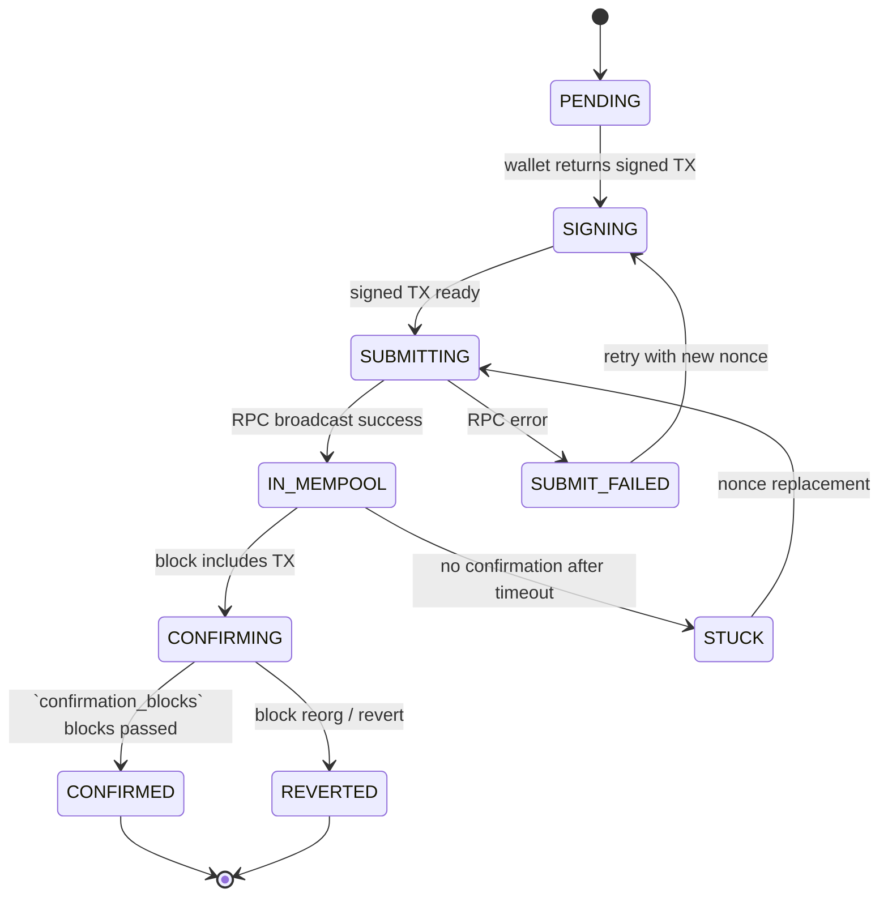

# Execution Engine

## Document type
Document type: [CONTRACT]

## Version
**Version:** 1.0.0 | **Status:** Canonical | **Last Updated:** 2026-07-29 | **Owner:** Trading Team

## Purpose
Defines chain transaction execution, confirmation, cancellation, and recovery — with explicit execution sequencing, timeout handling, and retry/resume behavior.

---

## 0. MVP Execution Phases

### Phase 1 — Simulation Only (CURRENT)
**Status:** Active | **Transaction Submission:** DISABLED | **Wallet Signing:** DISABLED

**Execution Engine Behavior:**
- Receives simulated execution payloads from trading engine
- Validates transaction structure and route
- Logs hypothetical transaction lifecycle
- **Hard blocks on actual RPC broadcast**
- No wallet interaction, no signing, no submission

**Hard Invariants:**
```python
if execution_mode == SIMULATION_ONLY:
    if transaction.attempt_broadcast:
        reject(transaction, code="PHASE_1_BROADCAST_BLOCK")
        return
    if wallet.attempt_signing:
        reject(transaction, code="PHASE_1_SIGNING_BLOCK")
        return
```

### Phase 2 — Operator-Approved
**Status:** Pending | **Transaction Submission:** REQUIRES_OPERATOR | **Wallet Signing:** OPERATOR_INITIATED

**Execution Engine Behavior:**
- Builds transactions as in Phase 3
- Submits to operator dashboard for approval
- Operator reviews and manually initiates signing
- Execution engine monitors and reconciles
- Risk engine enforces reduced limits

### Phase 3 — Autonomous
**Status:** Future | **Transaction Submission:** ENABLED | **Wallet Signing:** AUTONOMOUS

**Execution Engine Behavior:**
- Full autonomous transaction lifecycle
- MEV-protected submission via Flashbots/private RPCs
- Multi-chain execution with atomic routing
- Automatic retry and recovery
- Real-time reconciliation

---


## 1. Transaction Lifecycle State Machine



---

## 2. Execution Sequencing

### 2.1 Pre-Submission
1. Validate wallet has sufficient native token for gas: `balance >= gas_estimate × gas_multiplier`.
2. Validate target contract address matches expected DEX/pair.
3. Validate calldata encoding against ABI schema.
4. Estimate gas via `eth_estimateGas` (or equivalent).
5. If gas > `execution.gas.max_gas_limit`, abort with `GAS_LIMIT_EXCEEDED`.

### 2.2 Submission
1. Wallet signs transaction offline (no private key exposure to network).
2. Submit via `eth_sendRawTransaction` to primary RPC endpoint.
3. If primary RPC fails → fallback to secondary RPC endpoint.
4. Record TX hash, nonce, and submission timestamp.

### 2.3 Confirmation
1. Poll `eth_getTransactionReceipt` every `execution.poll_interval_ms` (default 1000ms).
2. Confirmation threshold: `execution.confirmation_blocks` (default 2 for EVM).
3. For each new block containing our TX, increment confirmation count.
4. Once count >= threshold, mark CONFIRMED.
5. Extract `logs` for event-driven downstream actions (e.g., swap event).

### 2.4 Reorg Handling
1. If a block reorg drops our TX below the confirmation threshold, decrement count.
2. If count reaches 0, transition to `REVERTED`.
3. Reorg safe depth: `execution.reorg_safe_depth` (default 12 blocks for EVM).

---

## 3. Timeout Handling

| Phase | Timeout | Config Key | Action on Timeout |
|-------|---------|------------|-------------------|
| Gas estimation | 5000ms | `execution.timeout_ms` | Retry 1×, then ABORT with `GAS_ESTIMATE_FAILED` |
| TX submission | 10000ms | `execution.timeout_ms` | Fallback RPC → retry → ABORT with `SUBMISSION_FAILED` |
| Mempool confirmation | `execution.timeout_ms` (30000ms) | `execution.timeout_ms` | Mark STUCK, attempt nonce replacement |
| Block confirmation | `execution.confirmation_timeout_ms` (60000ms) | `execution.confirmation_timeout_ms` | Mark REVERTED, return to caller |
| Total execution | `execution.total_timeout_ms` (120000ms) | `execution.total_timeout_ms` | Force abort, all retries exhausted |

---

## 4. Retry & Resume Behavior

### 4.1 Retry Strategy

| Error Type | Retry Count | Backoff | Backoff Cap | Next Action |
|------------|-------------|---------|-------------|-------------|
| RPC timeout (submit) | 3 | Exponential (1s, 2s, 4s) | 10s | Fallback RPC |
| RPC timeout (confirm) | 5 | Exponential (1s, 2s, 4s, 8s, 16s) | 30s | Fallback RPC |
| Nonce too low | 1 | Immediate | N/A | Increment nonce, resubmit |
| Gas too low | 3 | Incremental (10%, 20%, 30%) | 2× initial | Resubmit with higher gas |
| Insufficient funds | 0 | N/A | N/A | ABORT immediately |
| Revert (known) | 0 | N/A | N/A | Return revert reason to caller |
| Revert (unknown) | 1 | Immediate | N/A | Simulate with `eth_call` first |

### 4.2 Nonce Replacement (Stuck TX)
1. When TX is unconfirmed after `execution.timeout_ms` in mempool.
2. Create replacement TX with same nonce, 1.5× gas price, same calldata.
3. Submit replacement.
4. Wait `execution.confirmation_blocks` for replacement to confirm.
5. If replacement also stuck → escalate to operator (max 2 replacements).

### 4.3 Crash Resume
1. On restart, load incomplete transactions from persistent store.
2. For each TX in-flight, query chain for current status:
   - If confirmed → advance to next step.
   - If unconfirmed → wait for confirmation within grace timeout.
   - If not found → treat as not submitted, abort.
3. Nonce conflicts are resolved by scanning chain for the expected nonce.

---

## 5. Wallet & Signing Context

| Wallet Type | Signing Method | Security Level | Supported Chains |
|-------------|---------------|----------------|------------------|
| Software (encrypted keystore) | Offline signing | Medium | All EVM, Solana, Cosmos |
| Hardware wallet | Via provider API | High | EVM only |
| External (MetaMask, WalletConnect) | Via DApp bridge | Medium | EVM only |
| Exchange API | API key signing | Low-medium | CEX only |

All signing happens in the wallet process (Trust Domain T1). The execution engine receives only the signed transaction bytes — never the private key.

---

## 6. Gas Optimization

| Strategy | Description | Config Key |
|----------|-------------|------------|
| Dynamic gas pricing | Use `eth_maxPriorityFeePerGas` + base fee | `execution.gas.dynamic_enabled` |
| Max gas cap | Hard limit on total gas per TX | `execution.gas.max_gas_limit` |
| Multiplier | `gas_estimate × gas_multiplier` for safety margin | `execution.gas.multiplier` (default 1.2) |
| Priority fee floor | Minimum tip to validator | `execution.gas.priority_fee_gwei` (default 1) |

---

## 7. Multi-Chain Execution Protocol

### 7.1 Cross-Chain Execution Sequence

```
1. Trading Engine submits execution request for both legs:
   {trade_id, leg_1: {chain, dex, pair, amount, direction}, leg_2: {chain, dex, pair, amount, direction}}

2. Execution Engine processes legs in sequence:
   a. Leg 1: prepare TX → sign → submit → confirm.
   b. On Leg 1 confirmation: immediately initiate Leg 2.
   c. Leg 2: prepare TX → sign → submit → confirm.
   d. On Leg 2 confirmation: trade complete.

3. If Leg 1 and Leg 2 are on the SAME chain:
   - Attempt atomic multi-call (both legs in one TX) where supported.
   - If atomic not possible → sequential legs on same chain.

4. If Leg 1 and Leg 2 are on DIFFERENT chains:
   - Sequential: Leg 1 confirmed → Leg 2 submitted.
   - Cross-chain messaging NOT used (too slow for arbitrage).
   - Leg 2 parameters derived from Leg 1 actual received amount.
```

### 7.2 Multi-Chain Gas Handling

| Chain | Gas Payment | Gas Token | Gas Estimation |
|-------|------------|-----------|---------------|
| Ethereum | ETH from wallet | ETH | `eth_estimateGas` |
| Polygon | MATIC from wallet | MATIC | `eth_estimateGas` (EVM-compatible) |
| BSC | BNB from wallet | BNB | `eth_estimateGas` |
| Arbitrum | ETH from wallet | ETH | `eth_estimateGas` + L2 gas |
| Solana | SOL from wallet | SOL | Compute units + rent |
| Cosmos chains | Native token from wallet | Chain-specific | Gas estimation per chain |

### 7.3 Cross-Chain Timing Budgets

| Chain Pair | Leg 1 Confirm Time | Leg 2 Start Delay | Leg 2 Confirm Time | Total Budget |
|-----------|--------------------|--------------------|--------------------|-------------|
| Ethereum → Polygon | ~24s (2 blocks) | Immediate | ~2s | ~30s |
| Polygon → Ethereum | ~2s | Immediate | ~24s | ~30s |
| BSC → Ethereum | ~3s | Immediate | ~24s | ~30s |
| Ethereum → Arbitrum | ~24s | Immediate | ~2s | ~30s |
| Solana → Ethereum | ~0.4s | Immediate | ~24s | ~30s |

---

## 8. Gas Optimisation Logic

### 8.1 Dynamic Gas Pricing Algorithm

```
1. Query base fee from latest block: base_fee = eth_getBlockByNumber("latest").baseFeePerGas
2. Query priority fee suggestions: priority_fee = eth_maxPriorityFeePerGas OR default_priority_fee
3. Calculate max fee: max_fee = base_fee × max_fee_multiplier + priority_fee
4. If max_fee > execution.gas.max_price_gwei × 1e9 → ABORT (gas too expensive)
5. Apply multiplier: estimated_gas = eth_estimateGas × execution.gas.multiplier
6. Total gas cost: gas_cost_usd = estimated_gas × max_fee × eth_price_usd
7. If gas_cost_usd > execution.gas.max_cost_usd → ABORT (gas cost exceeds budget)
8. Submit TX with calculated max_fee and priority_fee.

Fallback for chains without EIP-1559:
  - Use fixed gas_price = historical_average × multiplier
  - Gas price bump on retry: previous_price × 1.5
```

### 8.2 Gas Optimisation Strategies

| Strategy | Implementation | Trigger | Savings |
|----------|---------------|---------|---------|
| **Dynamic pricing** | EIP-1559 base fee + priority fee | Always | 10-30% vs fixed pricing |
| **Low-priority submission** | Minimal priority fee during low activity | Off-peak hours | 40-60% vs peak |
| **Gas price monitoring** | Track gas trends, wait for dips | Gas > threshold, trade not urgent | Variable |
| **Batch submission** | Combine multiple operations in one TX | Same-chain arb with 2+ legs | 50-70% vs separate TXs |
| **Contract optimization** | Use gas-efficient DEX contracts (Uniswap V3 vs V2) | Route selection | 20-40% per leg |
| **Alternative chains** | Route through cheaper chains when possible | Cross-chain arb | 90%+ on L2 vs L1 |

---

## 9. Cross-Subsystem Integration

### 9.1 Who Calls Execution Engine

| Caller | Purpose | Contract |
|--------|---------|----------|
| Trading Engine | Submit/cancel trade legs | `execution.submit` / `execution.cancel` APIs |
| Risk Engine | Request execution risk check | `execution.risk_check` API |
| Recovery Coordination | Resume incomplete executions | `execution.resume` API |
| Dashboard Operator | Manual execution override | `dashboard.command` IPC |

### 9.2 Who Execution Engine Calls

| Target | Purpose | Contract |
|--------|---------|----------|
| Wallet Manager | Sign transactions | `wallet.sign` API |
| RPC Manager | Submit TX, confirm TX | `rpc.submit` / `rpc.confirm` APIs |
| Gas Optimiser | Estimate gas | `gas.estimate` API |
| MEV Protection | Submit via private pool | `mev.submit` API |
| Event Bus | Emit execution events | `execution.*` events |
| Trading Engine | Report leg status | `trade.leg.*` events |

### 9.3 Events Execution Engine Emits

| Event | Payload | Consumer |
|-------|---------|----------|
| `execution.submitted` | `{exec_id, trade_id, leg, chain, tx_hash, nonce, gas_price, ts}` | Trading Engine, Dashboard |
| `execution.confirming` | `{exec_id, confirmations, expected_confirmations, ts}` | Dashboard |
| `execution.confirmed` | `{exec_id, trade_id, leg, chain, tx_hash, block, gas_used, ts}` | Trading Engine, Risk Engine |
| `execution.reverted` | `{exec_id, trade_id, leg, chain, tx_hash, revert_reason, ts}` | Trading Engine, Risk Engine |
| `execution.stuck` | `{exec_id, trade_id, chain, tx_hash, mempool_time_ms, ts}` | Trading Engine |
| `execution.retried` | `{exec_id, trade_id, leg, attempt, new_tx_hash, gas_price_multiplier, ts}` | Trading Engine, Dashboard |
| `execution.gas.exceeded` | `{exec_id, chain, estimated_gas, max_gas, ts}` | Dashboard, Trading Engine |

### 9.4 Configuration Execution Engine Owns

| Config Key | Default | Description |
|-----------|---------|-------------|
| `execution.timeout_ms` | `30000` | Per-leg timeout |
| `execution.confirmation_timeout_ms` | `60000` | Confirmation timeout |
| `execution.total_timeout_ms` | `120000` | Total execution timeout |
| `execution.confirmation_blocks` | `2` | EVM confirmation threshold |
| `execution.reorg_safe_depth` | `12` | Reorg safe depth |
| `execution.gas.max_gas_limit` | `500000` | Max gas per TX |
| `execution.gas.max_price_gwei` | `50` | Max gas price |
| `execution.gas.multiplier` | `1.2` | Gas estimate multiplier |
| `execution.gas.dynamic_enabled` | `true` | EIP-1559 dynamic pricing |
| `execution.gas.priority_fee_gwei` | `1` | Priority fee floor |
| `execution.gas.max_cost_usd` | `5.0` | Max gas cost per leg |
| `execution.poll_interval_ms` | `1000` | Confirmation poll interval |
| `execution.retry.max_attempts` | `3` | Max retries per failure |

---

## Cross-References

- **TRADING-ENGINE.md** — Trade-level coordination that calls execution.
- **TRANSACTION-LIFECYCLE.md** — Detailed TX lifecycle per chain.
- **GAS-OPTIMISATION.md** — Gas calculation and optimization strategies.
- **MEV-PROTECTION.md** — MEV-resistant submission strategies.
- **WALLET-MANAGEMENT.md** — Wallet signing and key derivation.
- **RISK-ENGINE.md** — Risk checks before submission.
- **RPC-MANAGER.md** — RPC endpoint management and failover.
- **EXECUTION-STATE-MACHINE.md** — Execution state machine contract.
- **RECOVERY-COORDINATION.md** — Recovery coordination for incomplete executions.
- **CONFIGURATION-REFERENCE.md** — Execution config keys (`execution.*`).
- **END-TO-END-WIRING-CONTRACT.md** — Cross-subsystem wiring.
- **TRACEABILITY-MATRIX.md** — Execution requirement coverage.

---

## Version History

| Version | Date | Changes | Author |
|---------|------|---------|--------|
| 1.0.0 | 2026-07-29 | Added formal Document type declaration, Version block, and Version History section to satisfy [CONTRACT] compliance (`architecture-tests/validate_contracts.py`, `architecture-tests/validate_ownership.py`). Substantive content unchanged. | Trading Team |
