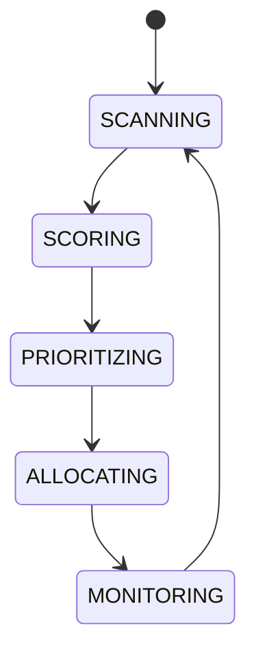

# Chain Rotation

## Document type
Document type: [CONTRACT]

## Purpose
Defines how configured chains are scored, prioritized, and allocated scanning capacity.

## State machine

## Scoring
Factors include gas price, latency, opportunity density, and historical reliability with configurable weights.

## Configuration
- `CHAIN_WEIGHTS`.
- `MIN_GAS_LIMIT`.
- `ALLOCATION_QUANTUM`.

## Rotation rules
- Chains are scored on a fixed cadence and prioritized by score.
- Scanning capacity is allocated in `ALLOCATION_QUANTUM` units to the highest-priority chains.
- A chain below `MIN_GAS_LIMIT` is excluded from scanning.
- A chain that becomes unreachable is demoted and the next best chain takes its capacity.
- Rotation is deterministic for the same inputs; monitoring feeds the next scoring cycle.

## Failure modes
- If a chain is unreachable, it is demoted and its capacity is reallocated to the next best chain.
- A chain that repeatedly fails scoring is suspended from scanning until revalidated.
- A stale scoring snapshot is never used to allocate capacity; allocation waits for fresh scores.
- Rotation events are recorded so capacity changes are auditable.
- A re-added chain re-enters scanning at the bottom of the priority order.
- Capacity reallocation is deterministic for the same scores.

## Cross-references
- `./chain-registry.md`
- `../../runtime/orchestrator.md`
- `../../operations/monitoring/health-checks.md`

## Operational Contract

This document owns chain scoring, prioritization, and scanning-capacity allocation. Chain identity and capabilities are owned by the chain registry; health signals by monitoring. This document schedules scanning across the configured set.

## Example
When Polygon becomes unreachable, it is demoted and its scanning capacity is reallocated to the next best chain.
