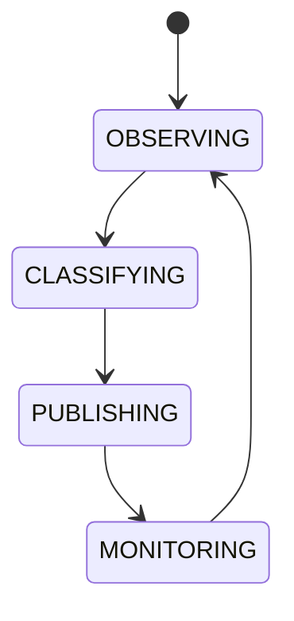

# Market Regime Detection

## Document type
Document type: [CONTRACT]

## Purpose
Defines the classification of market regimes that influence strategy selection and scheduling.

## Regimes
- Trending.
- Ranging.
- High volatility.
- Low liquidity.
- Congestion.
- Panic.
- Recovery.

## Classification rules
- Regime classification is computed from market data on a fixed cadence.
- Classification is deterministic for the same inputs; a noisy signal reduces confidence rather than flipping the label.
- A stale classification is reclassified with fresh data before it is published.
- Regime labels are published to strategy rotation and the orchestrator.
- Misclassification is detected through monitoring and corrected at the next cycle.

## State machine

## Failure modes
Misclassification, stale classification, noisy signal.

## Recovery
Reclassify with fresh data and reduce confidence if unstable.

## Cross-references
- `./market-intelligence.md`
- `./market-session.md`
- `../../execution/trading/strategy-rotation.md`
- `../../runtime/orchestrator.md`

## Operational Contract

This document owns market-regime classification. Market data is owned by the market-data contracts; this document derives regime labels from it for strategy and scheduling consumers.

## Example
A panic regime is detected from volatility and liquidity signals; strategy rotation withdraws aggressive strategies until the regime recovers.
