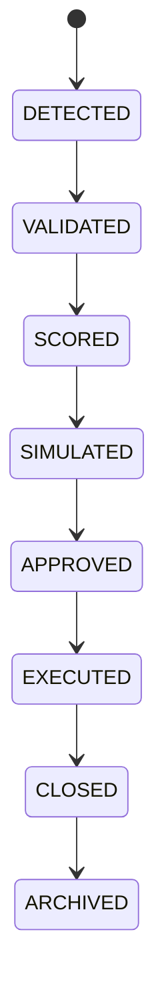

# Opportunity Lifecycle

## Document type
Document type: [CONTRACT]

## Purpose
Defines the lifecycle from detection to archival.

## State machine

## Lifecycle model
- Initial state: `DETECTED`.
- Terminal state: `ARCHIVED`.
- Allowed transitions: as shown in the state machine.
- Forbidden transitions: execution without approval; skipping validation; resurrecting an archived opportunity.
- Recovery: a failed validation returns the candidate to detection; a failed execution returns to simulated for re-evaluation.
- Failure: an opportunity that cannot be validated, scored, or executed is recorded with its failure reason and archived.

## Transition rules
- An opportunity moves to approval only after scoring and simulation pass configured thresholds.
- Execution is gated by risk and operator policy.
- Closed opportunities are archived with their outcome for analysis.
- Every transition is recorded with its trigger and reason in the decision ledger.
- A state machine violation is rejected and logged; it never silently mutates state.
- Archived opportunities retain their full history for analysis and audit.
- Recovery transitions re-enter the flow at the revalidated state, not the original.

## Cross-references
- `./opportunity-detection.md`
- `./opportunity-ranking.md`
- `../../execution/trading/trading-lifecycle.md`

## Operational Contract

Defines the lifecycle from discovery through validation, scoring, simulation, approval, execution, closure, and archive. Detection and ranking are owned by their documents; this document owns the state transitions between them.

## Example
An opportunity moves to approval only after scoring and simulation pass configured thresholds; a failed execution returns it to simulation for re-evaluation.
