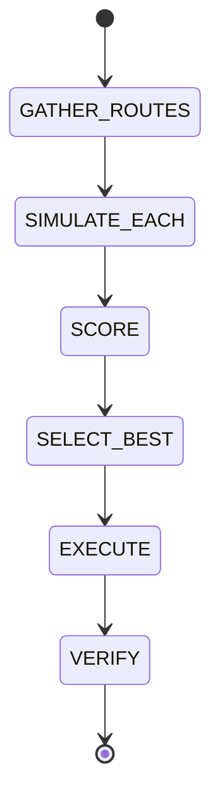

# Route Optimization

## Document type
This document is an overview, reference, or index as noted below.

# Route Optimization

## 0. Provider Trust Boundaries

### Route Data Sources
**Route optimization uses multiple provider types with clear authority:**

| Data Source | Authority | Trust Level | Role |
|-------------|-----------|-------------|------|
| DEX Quotes | EXECUTION_AUTHORITY | HIGH | Actual trade pricing |
| Oracle Prices | PRICE_REFERENCE | HIGH | Validation only |
| Gas Estimates | EXECUTION_ADVISORY | MEDIUM | Cost calculation |
| AI Analysis | ANALYSIS_ONLY | MEDIUM | Strategy suggestions |

### Critical Invariants
- **DEX quotes are execution authority** — oracle prices validate but never override
- **AI cannot override route selection** — AI can only suggest, deterministic logic decides
- **Multi-source validation required** — route must pass oracle validation and DEX quote sanity checks

### Disagreement Handling
**Oracle vs DEX Quote Disagreement:**
- If deviation > 2%: REJECT route (possible manipulation or stale data)
- If deviation 1-2%: Flag for review, allow with reduced confidence
- If deviation < 1%: Proceed with normal confidence

**Multi-DEX Disagreement:**
- If multiple DEXes show > 3% price difference: Flag as potential arbitrage opportunity
- If single DEX shows anomalous price: REJECT (possible manipulation)
- Use median price across DEXes for validation

### Route Validation Requirements
**Phase 1/2:**
- DEX quote must be < 5 minutes old
- Oracle validation must pass (within 2% of DEX quote)
- Gas estimate must be from reliable source

**Phase 3:**
- DEX quote must be < 1 minute old
- Multi-oracle consensus required (≥2 oracles, within 2% of DEX)
- Real-time gas estimate from primary RPC

---

## Purpose
Defines route gathering, simulation, scoring, selection, execution, and verification.

## State machine

## Scoring
Multi-objective scoring uses profit, gas, slippage, historical success, confidence, and complexity with configurable weights.

## Configuration
- ROUTE_SCORE_WEIGHTS.
- MAX_ROUTES_TO_EVALUATE.
- MIN_PROFIT_THRESHOLD.

## Failure modes
If the best route fails simulation, fallback to the second best and log the failure.

## Cross-references
- `../../execution/simulation/simulation-engine.md`
- `../../execution/transactions/execution-lifecycle.md`
- `../../execution/trading/trading-lifecycle.md`

## Operational Contract
Defines optimization objectives, constraints, scoring, and route comparison logic.

## Example
The optimizer prefers the route with the best net expected return.

## Required details
- Define scoring, validation, replay, and batch optimization behavior.

## Optimization rules
- Define route scoring inputs, validation, replay, and batch optimization behavior.
- Define stale market data handling and route rejection rules.
