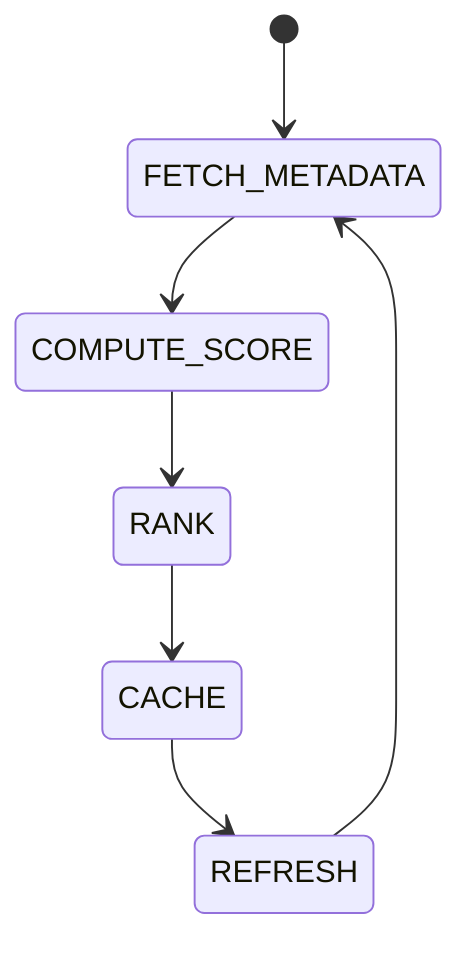

# Token Intelligence

## Document type
Document type: [CONTRACT]

## Purpose
Defines token metadata ingestion, scoring, ranking, caching, and refresh behavior.

## State machine

## Scoring
Combines liquidity, volatility, historical spread, protocol coverage, and DEX availability using configurable weights.

## Configuration
- `SCORE_WEIGHTS`.
- `MIN_SCORE`.
- `REFRESH_INTERVAL`.

## Intelligence rules
- Metadata is enriched with source provenance; a record without provenance is not served.
- A token below `MIN_SCORE` is ranked low and excluded from execution-facing surfaces.
- Scores and rankings are deterministic for the same inputs.
- If a metadata source fails, cached values are used and a warning is logged; a stale cache is labeled stale.
- Enriched records include symbol, chain, liquidity, risk, and discovery source.
- Score weights are configuration, validated before use.
- Refresh failures degrade the surface visibly rather than blocking consumers.
- Intelligence output is consumed read-only by detection and ranking.
- Token identity is owned by the token registry; this document derives intelligence from it.

## Failure modes
If metadata source fails, use cached values and log a warning.

## Cross-references
- `../core/market-data.md`
- `../chains/chain-intelligence.md`
- `../../interfaces/api/domain-model.md`
- `./token-registry.md`

## Operational Contract

Defines token enrichment, scoring inputs, validation, metadata aggregation, and downstream usage. Token identity is owned by the token registry; this document owns the intelligence derived from it.

## Example
An enriched token record includes symbol, chain, liquidity, risk, and discovery source, and is ranked below `MIN_SCORE` is withheld from execution surfaces.
