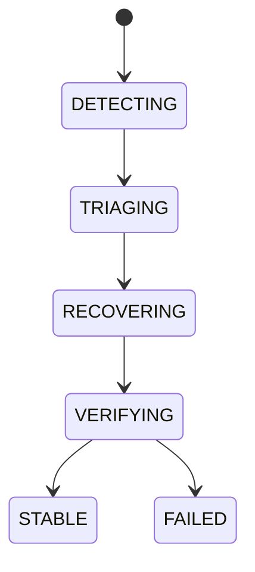

# Self-Healing

## Document type
Document type: [CONTRACT]

## Purpose
Defines the canonical recovery actions for workers, RPC, providers, caches, wallets, and queues.

## State machine

## Failure modes
Transient failure, repeated failure, unrecoverable failure.

## Recovery actions
- Restart worker.
- Reconnect RPC.
- Switch provider.
- Reload cache.
- Recover queue.
- Notify operators.

## Healing rules
- A transient failure is retried with bounded backoff.
- A repeated failure escalates after the retry budget; it never heals silently.
- An unrecoverable failure is surfaced to operators and the component is held safe.
- Every healing action is verified before the component is declared stable.
- Healing is observable: recovery events are recorded in the recovery metrics.
- Healing actions are ordered by risk; a destructive action requires operator confirmation.
- A healed component resumes at its last safe state, never mid-operation.
- Healing is bounded by the performance and recovery budgets.

## Cross-references
- `../monitoring/health-checks.md`
- `../reliability/provider-resilience.md`
- `./recovery-and-failover.md`

## Operational Contract

Defines the canonical recovery actions for workers, RPC, providers, caches, wallets, and queues. Detection and verification are owned by health checks; this document owns the healing actions between them.

## Example
A worker that fails transiently is restarted with backoff; after repeated failures it escalates to operators instead of retrying forever.
