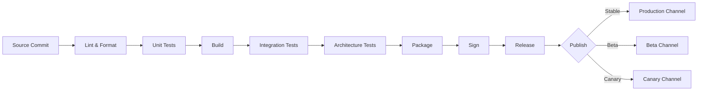

# App Builder Workflow

## Document type
Document type: [REFERENCE]

## Version
**Version:** 0.2.0 | **Status:** Draft | **Last Updated:** 2026-07-27 | **Owner:** DevOps Team

## Purpose
Defines the workflow for building, testing, packaging, signing, and releasing the Windows desktop application — with explicit pipeline stages, gate checks, failure handling, and rollback procedures.

---

## 1. Build Pipeline Overview



---

## 2. Stage Definitions

### 2.1 Lint & Format
| Tool | Config | Failure Action |
|------|--------|----------------|
| ESLint (TypeScript) | `.eslintrc.yaml` | Block pipeline |
| Prettier | `.prettierrc.yaml` | Auto-fix + warn if > 10 fixes |
| Markdown lint | `.markdownlint.yaml` | Warn (docs only) |

### 2.2 Unit Tests
| Framework | Coverage Threshold | Failure Action |
|-----------|-------------------|----------------|
| Vitest / Jest | `test.coverage.threshold`: 80% lines, 70% branches | Block pipeline |
| Per subsystem | Min coverage per package | Individual package fails if below threshold |

### 2.3 Build
| Step | Output | Validation |
|------|--------|------------|
| TypeScript compile | `dist/` | Zero `tsc` errors |
| Electron / Tauri build | Platform binaries | Correct version embedded |
| Resource bundling | Assets, locales, icons | All expected files present |

### 2.4 Integration Tests
| Test Suite | Environment | Duration Budget |
|------------|-------------|----------------|
| API contract tests | Mock services | 5 min |
| E2E trade flow | Simulated chain | 10 min |
| Plugin lifecycle | Test plugins | 3 min |
| Windows-specific | Windows CI runner | 10 min |

### 2.5 Architecture Tests
| Check | Tool | Failure Action |
|-------|------|----------------|
| Traceability matrix validation | Custom script | Block pipeline |
| Dependency graph enforcement | `dependency-cruiser` | Block pipeline |
| Contract compliance | Schema validator | Block pipeline |
| Trust boundary enforcement | Static analysis | Block pipeline |

### 2.6 Package
| Platform | Package Format | Installer |
|----------|---------------|-----------|
| Windows x64 | `.exe` (NSIS) | `ApexTrader-Setup-<version>.exe` |
| Windows ARM64 | `.exe` (NSIS) | `ApexTrader-Setup-<version>-arm64.exe` |
| Portable | `.zip` | `ApexTrader-<version>-portable.zip` |

### 2.7 Sign
| Artifact | Signing Method | Certificate |
|----------|----------------|-------------|
| `.exe` installer | Authenticode (signtool) | EV Code Signing cert |
| `.msi` (optional) | Authenticode | EV Code Signing cert |
| `.zip` archive | Not signed | N/A (checksum instead) |

### 2.8 Release
| Channel | Tag Pattern | Auto-Update | Rollback Window |
|---------|-------------|-------------|-----------------|
| Canary | `v<version>-canary.N` | Immediate (opt-in) | 2 hours |
| Beta | `v<version>-beta.N` | Automatic | 24 hours |
| Production | `v<version>` | Gradual rollout (10% → 50% → 100%) | 7 days |

---

## 3. Gate Checks

Each gate must pass before the pipeline proceeds to the next stage.

| Gate | Stage | Condition | Override |
|------|-------|-----------|----------|
| G1 | Lint | Zero errors | Maintainer approval |
| G2 | Unit tests | Coverage >= 80% lines, zero failures | Lead developer approval |
| G3 | Build | Zero compile errors | None |
| G4 | Integration tests | Zero failures | Lead developer approval |
| G5 | Architecture tests | Zero violations | Architecture owner approval |
| G6 | Security scan | Zero critical/high findings | Security team approval |
| G7 | Signing | All artifacts signed | None (release requirement) |
| G8 | Release approval | PM sign-off + changelog review | Executive approval |

---

## 4. Failure Handling

| Failure Type | Action | Notification |
|--------------|--------|--------------|
| Build failure | Pipeline blocked. Fix committed, rebuild. | PR comment, Slack notification |
| Test failure | Pipeline blocked. Tests must pass. | Test report generated, PR status failed |
| Gate override | Pipeline proceeds with approval recorded. | Approval logged to audit trail |
| Signing failure | Secured artifact not released. Wait for cert fix. | Security team paged |
| Deployment failure (canary) | Canary rolled back. Root cause investigation. | DevOps + PM notified |
| Deployment failure (production) | Immediate full rollback to previous version. | All channels notified |

---

## 5. Rollback Procedure

### Canary / Beta Rollback
```
1. Identify bad version.
2. Set rollout percentage to 0%.
3. Existing canary/beta clients receive rollback update (to last good version).
4. Investigate root cause from canary telemetry.
5. Fix, rebuild, re-release to canary channel.
```

### Production Rollback
```
1. Emergency: set rollout to 0%. All clients get downgrade update.
2. Tag the rollback point: `v<previous_version>-rollback-<timestamp>`.
3. Root cause investigation: 24-hour SLA.
4. Hotfix: commit fix, fast-track through pipeline (canary → beta → production in 4 hours).
```

---

## 6. Artifact Retention

| Artifact | Retention | Location |
|----------|-----------|----------|
| Build artifacts (.exe, .zip) | 90 days | CI artifact store |
| Signed installers | Permanent (with release) | GitHub Releases / S3 |
| Test reports | 30 days | CI artifact store |
| Build logs | 7 days | CI log store |
| Audit trail (gates) | 365 days | Audit log |

---

## Cross-References

- **BUILD-RELEASE-CICD.md** — local governance pipeline configuration.
- **WINDOWS-DEPLOYMENT.md** — Windows-specific deployment details.
- **TESTING-GUIDE.md** — Test framework and writing tests.
- **DEPLOYMENT.md** — Deployment configuration.
- **SIGNING-POLICY.md** (future) — Code signing policy and certificate management. Not yet authored; tracked as a known forward reference, not a broken link, per the Repository Canonicality Repair's identifier-normalization remediation (`tools/governance/references/path_resolver.py`).
- **CONFIGURATION-REFERENCE.md** — Build config keys (`build.*`).
- **TRACEABILITY-MATRIX.md** — Build/release requirement coverage.

---

## Version History

| Version | Date | Changes | Author |
|---------|------|---------|--------|
| 0.2.0 | 2026-07-27 | Full pipeline with stages, gates, failure handling, rollback, artifact retention | DevOps Team |
| 0.1.0 | 2026-07-27 | Initial stub | DevOps Team |
