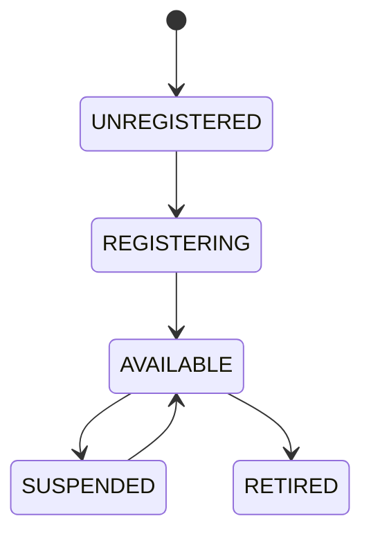

# Service Registry

## Document type
Document type: [CONTRACT]

## Version
**Version:** 1.0.0 | **Status:** Canonical | **Last Updated:** 2026-07-29 | **Owner:** Runtime Team

## Purpose
Defines the canonical registration and lookup mechanism for runtime services.

## Contract
Nothing instantiates services directly; everything registers with the kernel-managed registry.

## State machine

## Validation
Service identifiers must be unique, stable, and versioned.

## Failure modes
Duplicate registration, stale service reference, unavailable dependency, version mismatch.

## Recovery
Unregister stale services, rebind dependencies, and rehydrate from kernel state.

## Cross-references
- `../architecture/apex-kernel.md`
- `../data/registries/registry-system.md`
- `./orchestrator.md`

## Governance Rules
Defines service identity, registration, status, ownership, and versioned service metadata.

## Example
A service entry exposes health, version, and lifecycle state before it is scheduled.

## Required details
- Define SCM mapping, dependencies, recovery, and lookup.

## Registry rules
- Define service names, dependencies, recovery actions, and lookup behavior.
- Define Windows SCM mapping for each registered service.

---

## Version History

| Version | Date | Changes | Author |
|---------|------|---------|--------|
| 1.0.0 | 2026-07-29 | Added formal Document type declaration, Version block, and Version History section to satisfy [CONTRACT] compliance (`architecture-tests/validate_contracts.py`, `architecture-tests/validate_ownership.py`). Substantive content unchanged. | Runtime Team |
