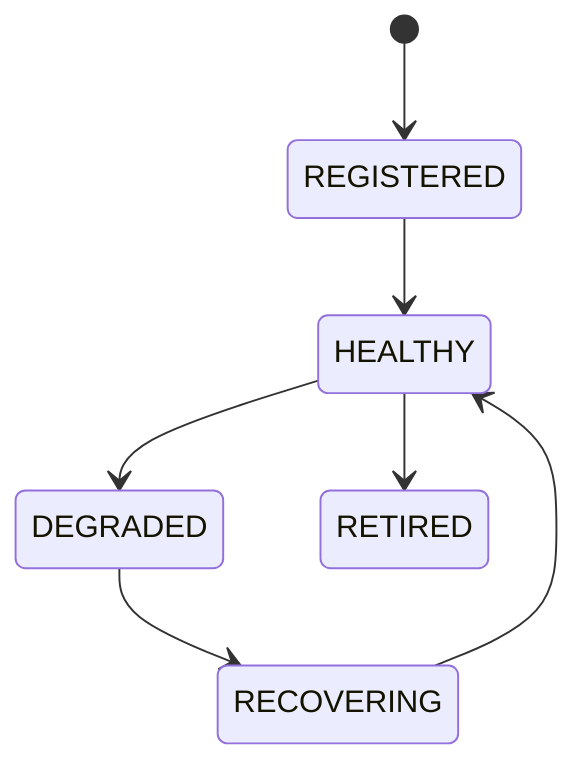

# Resource Manager

## Version
**Version:** 1.0.0 | **Status:** Canonical | **Last Updated:** 2026-07-29 | **Owner:** Runtime Team

## Document type
This document is an overview, reference, or index as noted below.

# Resource Manager

## Purpose
Defines unified resource lifecycle management for wallets, workers, chains, AI, plugins, RPC, storage, and queues.

## State machine

## Failure modes
Missing resource, stale version, health degradation, exhaustion.

## Recovery
Rebind resource, replace endpoint, restart service, or retire resource.

## Cross-references
- `../architecture/apex-kernel.md`
- `./service-registry.md`
- `../data/registries/registry-system.md`
- `./worker-pool.md`

## Operational Contract
Defines allocation, quotas, cleanup, contention handling, and resource lifecycle.

## Example
A worker is paused when resource usage exceeds limits.

---

## Version History

| Version | Date | Changes | Author |
|---------|------|---------|--------|
| 1.0.0 | 2026-07-29 | Added formal Document type declaration, Version block, and Version History section to satisfy [CONTRACT] compliance (`architecture-tests/validate_contracts.py`, `architecture-tests/validate_ownership.py`). Substantive content unchanged. | Runtime Team |
