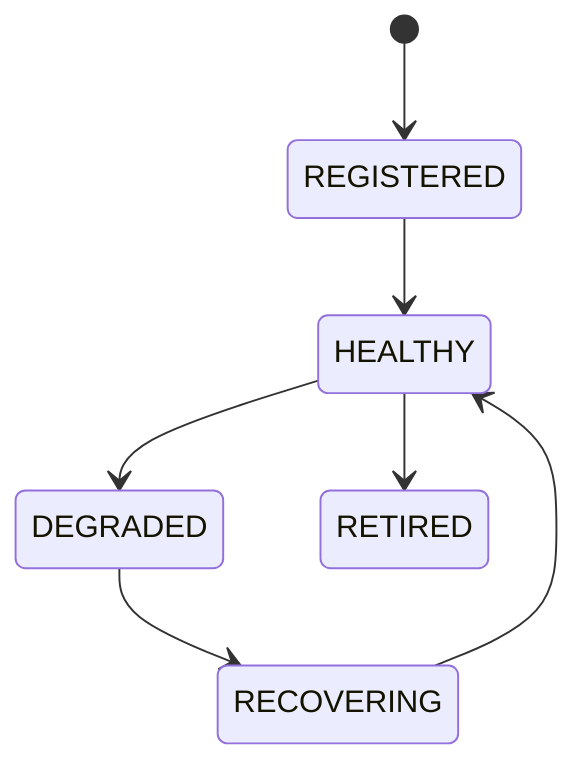

# Resource Manager

## Version
**Version:** 1.1.0 | **Status:** Canonical | **Last Updated:** 2026-08-02 | **Owner:** Runtime Team

## Document type
Document type: [CONTRACT]

# Resource Manager

## Purpose
Defines unified resource lifecycle management for wallets, workers, chains, AI, plugins, RPC, storage, and queues.

## Resource classes
- **Wallets** — connection handles, keychain references, and approval state.
- **Workers** — pool slots, task queues, and thread budgets.
- **Chains and RPC** — endpoints, providers, and connection pools.
- **AI providers** — model endpoints, token budgets, and cost caps.
- **Plugins** — sandbox processes, memory, and CPU quotas.
- **Storage** — database handles, cache capacity, and file paths.
- **Queues** — depth, concurrency, and backpressure limits.

## Allocation and quotas
- Every resource is registered before allocation and assigned to an owning subsystem.
- Quotas are defined per resource class and bounded by operator configuration.
- Contention is resolved by priority: safety-critical paths (risk, execution) preempt non-critical work.
- Exhaustion is a degraded state: allocation requests beyond quota are rejected, not queued indefinitely.

## Cleanup rules
- Resources are released on subsystem retirement, shutdown, or quota violation.
- Cleanup is idempotent and safe to retry after a crash.
- A retired resource is unregistered and its handles closed.

## State machine

## Failure modes
Missing resource, stale version, health degradation, exhaustion.

## Recovery
Rebind resource, replace endpoint, restart service, or retire resource.

## Cross-references
- `../architecture/apex-kernel.md`
- `./service-registry.md`
- `../data/registries/registry-system.md`
- `./worker-pool.md`

## Operational Contract

Defines allocation, quotas, cleanup, contention handling, and resource lifecycle. The resource manager owns lifecycle state; subsystems own their resource usage. A worker is paused when resource usage exceeds limits.

## Example
A worker is paused when resource usage exceeds limits; the pause is recorded and reversed only after usage returns below quota.

---

## Version History

| Version | Date | Changes | Author |
|---------|------|---------|--------|
| 1.1.0 | 2026-08-02 | Expanded canonical content: replaced placeholder directives and generic boilerplate with grounded ownership, rules, lifecycle, failure, and cross-reference detail. | Runtime Team |
| 1.0.0 | 2026-07-29 | Added formal Document type declaration, Version block, and Version History section to satisfy [CONTRACT] compliance (`architecture-tests/validate_contracts.py`, `architecture-tests/validate_ownership.py`). Substantive content unchanged. | Runtime Team |
