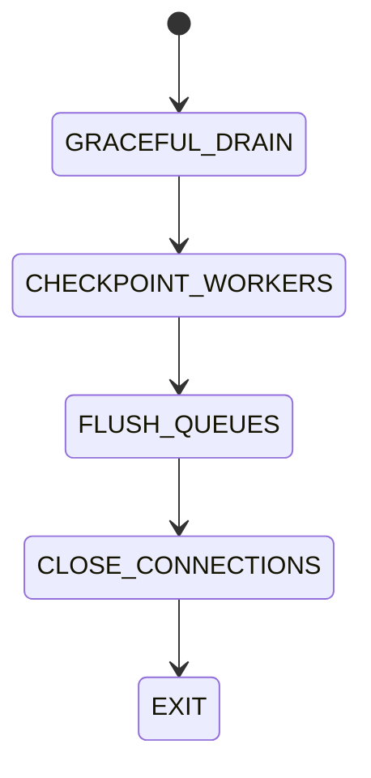

# Shutdown Lifecycle

## Document type
Document type: [CONTRACT]

## Purpose
Defines controlled shutdown behavior for the APEX runtime.

## Shutdown order
- Execution stops before caches are flushed and state is saved.
- Workers are stopped in dependency order; the execution worker stops before the data worker.
- Queues are flushed and drained before connections are closed.
- Persisted state is checkpointed before process exit.

## State machine

## Allowed transitions
- GRACEFUL_DRAIN -> CHECKPOINT_WORKERS.
- CHECKPOINT_WORKERS -> FLUSH_QUEUES.
- FLUSH_QUEUES -> CLOSE_CONNECTIONS.
- CLOSE_CONNECTIONS -> EXIT.

## Forbidden transitions
- GRACEFUL_DRAIN -> EXIT.
- CHECKPOINT_WORKERS -> EXIT.
- FLUSH_QUEUES -> CHECKPOINT_WORKERS.

## Recovery
- If checkpoint fails, the process remains in GRACEFUL_DRAIN and retries checkpointing.
- If queue flushing fails, the process stays in FLUSH_QUEUES and retries with bounded backoff.
- A failed shutdown never exits with unflushed state.

## Forced shutdown
- A forced shutdown bypasses the graceful path only after operator intervention or watchdog timeout.
- Forced shutdown must still persist the last checkpoint before exit where possible.
- The watchdog escalates a shutdown stuck in any stage for longer than the configured budget.

## Lifecycle model
- Initial state: `GRACEFUL_DRAIN`.
- Terminal state: `EXIT`.
- Allowed transitions: as listed above.
- Forbidden transitions: as listed above.
- Recovery transitions: retry within the current stage on failure.
- Failure transitions: escalation to the watchdog, then forced shutdown.

## Cross-references
- `../operations/reliability/runtime-operations.md`
- `./orchestrator.md`

## Operational Contract
Defines graceful shutdown, queue flushing, state persistence, worker stop order, and final disposal.

## Example
Execution stops before caches are flushed and state is saved; a failed checkpoint keeps the process in the drain stage until retries succeed or the watchdog forces shutdown.
