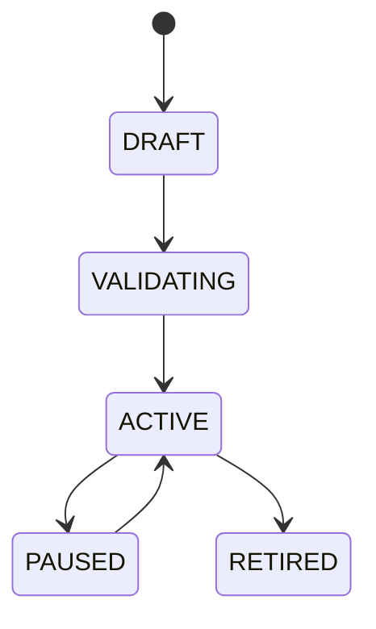

# Workflow Builder

## Document type
Document type: [CONTRACT]

## Purpose
Defines user-authored automation workflows that connect events, gates, actions, and notifications.

## Workflow model
- A workflow is a directed graph of nodes: event triggers, gates, actions, and notifications.
- Workflows are event-driven; they execute when their trigger events arrive.
- Activation is policy-checked: a workflow cannot be activated if it violates policy gates.
- Each workflow has a draft, validated, active, paused, and retired lifecycle.

## State machine

## Validation rules
- The graph must be acyclic; loop detection rejects a cyclic workflow at validation.
- Every action node must resolve to a registered action handler.
- Every gate must resolve to a policy in the policy engine.
- A workflow with an invalid graph, missing handler, or policy violation cannot activate.

## Contract
Workflows are event-driven and policy-checked before activation.

## Failure modes
Invalid graph, policy violation, missing action handler, loop detection.

## Recovery
Pause workflow, require correction, or route to fallback manual operation.

## Notification nodes
- A notification node routes to the notification center with the declared severity.
- A workflow action failure is reported, never swallowed.

## Cross-references
- `../interfaces/events/event-bus.md`
- `../execution/risk-policy/policy-engine.md`
- `./orchestrator.md`
- `../dashboard/ui-dashboard-spec.md`

## Operational Contract

This document owns the workflow-authoring model and activation rules. The event bus owns event semantics, the policy engine owns policy semantics, and the orchestrator owns runtime sequencing. This document does not own those systems; it composes them.

## Example
A workflow that pauses trading when the risk exposure gate trips is validated against the risk policy before it can activate.
